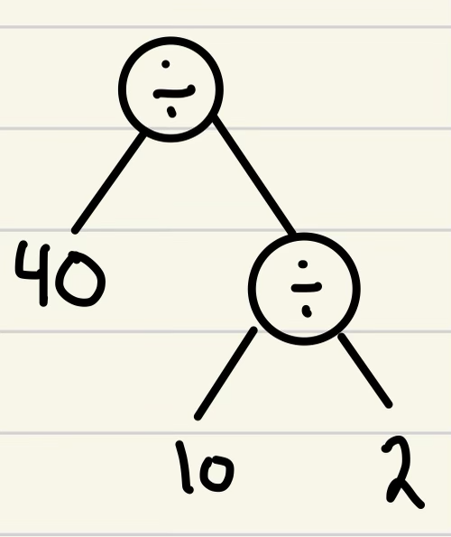

# Notes for Unit 1 <!-- omit in toc -->

## Table of Contents <!-- omit in toc -->

* [Important Note](#important-note)
* [Lecture 1](#lecture-1)
  * [Course Overview](#course-overview)
  * [Goals](#goals)
  * [Some logistics](#some-logistics)
  * [Grading](#grading)
  * [What we are using](#what-we-are-using)
  * [Expectations](#expectations)
  * [MyPL Usage](#mypl-usage)
    * [Info help with hw-1](#info-help-with-hw-1)
    * [Intro Notes / Usage](#intro-notes--usage)
* [Monday 1](#monday-1)
  * [Exercises](#exercises)
* [Lecture 2](#lecture-2)
  * [Compilation](#compilation)
    * [Front End Steps](#front-end-steps)
    * [PL Backend Steps](#pl-backend-steps)
  * [Interpretation](#interpretation)
  * [MyPL Implementation](#mypl-implementation)
  * [Paragraph Example](#paragraph-example)
  * [Types of Interpreters](#types-of-interpreters)
    * ["Transpiler"](#transpiler)
  * [Lexical Analysis (Lexer)](#lexical-analysis-lexer)
* [Lecture 3](#lecture-3)
  * [Tokens](#tokens)
  * [Token Streams](#token-streams)
    * [Examples](#examples)
  * [Syntax](#syntax)
  * [Formal Grammars](#formal-grammars)
  * [Grammar Rules](#grammar-rules)
    * [Construct](#construct)
* [Monday 2](#monday-2)
  * [MyPL Quiz Notes](#mypl-quiz-notes)
  * [GTest](#gtest)
  * [Hints for HW2](#hints-for-hw2)
* [Lecture 4](#lecture-4)
  * [Grammar Rules (Cont.)](#grammar-rules-cont)
    * [Regular Rules](#regular-rules)
    * [Contex Free Rules](#contex-free-rules)
  * [BNF notation](#bnf-notation)
* [Lecture 5](#lecture-5)
  * [Statement list](#statement-list)
  * [Derivation](#derivation)
  * [Parse Tree](#parse-tree)
  * [LL(k) Parser](#llk-parser)
  * [Exercise problems](#exercise-problems)
* [Lecture 6](#lecture-6)
  * [Statement List (Cont.)](#statement-list-cont)
  * [Recursive Descent](#recursive-descent)
  * [HW3](#hw3)
* [Lecture 7](#lecture-7)
  * [Abstract Syntax Trees \& Parsing](#abstract-syntax-trees--parsing)
  * [New Techniques in MyPL](#new-techniques-in-mypl)
* [Monday 4](#monday-4)
  * [Quiz 3 Answers](#quiz-3-answers)
  * [AST classes](#ast-classes)
* [Lecture 8](#lecture-8)
  * [Pretty Print for HW4](#pretty-print-for-hw4)
  * [Navigating AST](#navigating-ast)
    * [Visitor Pattern](#visitor-pattern)
  * [AST Classes](#ast-classes-1)
* [Lecture 9](#lecture-9)
  * [Operator Associativity](#operator-associativity)
    * [Example](#example)
  * [Approaches to deal w/ left-associativity](#approaches-to-deal-w-left-associativity)
    * [2nd Approach](#2nd-approach)
  * [Operator Precedence](#operator-precedence)
* [Lecture 10](#lecture-10)
  * [Semantic Analysis 1](#semantic-analysis-1)
  * [The goal of Semantic Analysis](#the-goal-of-semantic-analysis)
    * [HW5](#hw5)
* [Monday 5](#monday-5)
  * [Tips For HW-5](#tips-for-hw-5)
    * [Built in functions in MyPL](#built-in-functions-in-mypl)
* [Lecture 12](#lecture-12)
  * [Semantic Analysis 2](#semantic-analysis-2)
    * [Inferred Types Stored in curr\_type](#inferred-types-stored-in-curr_type)
    * [Expr](#expr)
  * [Tricky parts of HW5](#tricky-parts-of-hw5)
  * [User-Defined Types (Structs) in MyPL](#user-defined-types-structs-in-mypl)
* [Lecture 13](#lecture-13)
  * [Semantic Analysis 3](#semantic-analysis-3)
    * [Functions (and built-in Functions) in MyPL](#functions-and-built-in-functions-in-mypl)
    * [Handling Return Statements](#handling-return-statements)
    * [Type Inference Rules](#type-inference-rules)
* [Monday 6](#monday-6)
  * [Exam 1 Info](#exam-1-info)

## Important Note

All images are drawn by Dominic O.  

## Lecture 1

### Course Overview

* Deep dive into programming language (PL) design & implementation
  * Implement made up "MyPL" language.
  * Explore functional programming

### Goals

* More progressive experience
* better understanding how compilers/interpreters work
* better understanding of language design
  * why are some constructs the way they are
* exposure to different "paradigms"
  * different ways to think about programming, or programming approaches

### Some logistics

* The website `https://cs.gonzaga.edu/faculty/bowers/courses/cpsc326/` contains all the links needed for the course
* The discussion section will be for us to ask questions and work together
  * this is going to be really good and useful
* Canvas will be used to post grades

### Grading

* Every assignment is worth a certain amount of points
* Total of 700
  * HW (9x): First 7 @30 & Last 2 @20 = 250
  * Quizzes (Highest 10x): 10@10 = 100
  * Exams (2x): 2@100 = 200
  * Attendance: 60 (2 per lecture)
  * Final Project: 90
* To pass the course, you must get at least 60% for Exams+Quizzes and for Homework+Final Project
* Late policy: (Don't get behind...)
  * First 6 HW assignments (NOT 7!)
    * one opportunity to get it regraded (up to 70%)

### What we are using

* CMake
* make
* g++ (v20)
* Google Test (gtest)
* gdb (useful)
* Valgrind (optional)

### Expectations

* Everyone should take their responsibility for their own learning
  * **SEEK HELP IF YOU DON'T UNDERSTAND**
    * piazza, office hours, discussion lecture, email, etc...
* Everyone should engage and participate
  * put away distractions
  * take notes
* start assignments early
  * "it gets difficult"
    * crap...

### MyPL Usage

#### Info help with hw-1

* To run it, it'll be like python
  * `./mypl myProg.mypl`
* HW1 will be to make a shell that can take in all the flags
  * like `./mypl --help`
* *NOTE* use ctrl-d to end the mode if no file given and in type mode (wow i am bad at describing that, but it makes sense to me)

#### Intro Notes / Usage

* Strongly typed
  * this means that all type errors are detected before rune-time
* Comments
  * \# and only single line
* Primitive types / base types
  * `int double bool char string void`
    * `void` used for functions
  * Values
    * `1, 2, 4` - ints
    * `13.1, 1.11` - doubles
      * `0.0` is allowed, `.0` is not
    * `true, false` - bool
    * `'a'`, 'b'` - char
    * `"this is right!"` - string
      * cant go onto a new line. i.e. cant do stuff like python's `""" multiline"""`
    * null
      * any variable can be set to null
* Variable declarations:
  * type, name, initializer
    * `int x = 0`
    * `char y = 'a'`
    * `string s = null`
    * `int u = null`
      * **Note**
        * null can be used for `== !=` and initialization, but nothing else
          * 5 + null is an error
          * 5 <= null is an error
* Comparators
  * `==, !=, <, <=, >, >=`
  * `or and not`
  * all expressions can be parenthesized
    * `(x<=y) and not (y>z)`
* Assignment stunts

```cpp
x = 5
a = 22
```

* for loops

```cpp
for (int i = 0; i < 10; i = i + 1){ 
    ...
}
```

* While loops

```cpp
while (x>5){ 
    ...
} 
```

* If statements
  
```cpp
if (true){ 
    ...
}
else if (false){ (may have been elseif with no space) 
    ...
}
```

* Arithmetic
  * `+, -, * /`
    * can't mix the types
      * int op int
      * double op double
      * `5+2.1` is a type error
    * `to_int(string)`
    * `to_double(string or int)`
    * `to_string(anything)`

* Functions
  * they have a return type

```cpp
int f(int x, int y){
    return x + y
}
```

* Additional notes
  * No negative symbol
  * No semicolon
  * `to_int(string)`
  * `to_double(string or int)`
  * `to_string(anything)`
  * `concat(__,__)`
  * example of stuff `int r = f(3,4)`
  * no increment or decrement
  * `struct` (see example)
  * `print(...)` (see example)

```cpp
struct Node{
    int val,
    Node next
}

void println(int x){
    print(x)
    print('\n')
}
```

## Monday 1

```cpp
void print_leaves(const Node* root){
    if(root == nullptr)
        return; // probably wont happen
    if(root->left)
        print_leaves(root->left)
    if(root->right)
        print)leaves(root->right)
    if(!root->left && !root->right)
        cout << root->val << endl;
}
```

### Exercises

1. Write a `MyPL` function that computes the sum of a given array of integer values

    ```c
    int sum(array int xs){
        int sum = 0
        for(int i = 0; i < length(xs); i = i + 1){
            sum = sum + xs[i]
        }
        return sum
    }
    ```

1. Write a `MyPL` program that repeatedly prompts a user for a number until thy enter "-1", and then prints out the sum of the numbers they entered (excluding -1)

    ```c
    void main(){
        int NEG.ONE = 0 - 1
        int sum = 0
        int val = 0
        while(val != NEG.ONE){
            print("Please enter an int (-1 to quit): ")
            val = to_int(input())
            if(val != NEG.ONE){
                sum = sum + val
            }
        }
        print("The sum is: ")
        print(sum)
    }
    ```

1. Implement Merge Sort in `MyPL`

    ```c
    void merge_sort(array int A, int start, int end){
        if(start < end){
            int mid = (start + end) / 2
            merge_sort(A, start, mid)   # recursive step
            merge_sort(A, mid + 1, end) # recursive step
            merge(A, start, mid, end)   # merge sublists
        }
    }

## Lecture 2

### Compilation

* Uses the design principle: Seperation of Concerns
* Typical assembly line, parts come in and people have specific jobs
  * each box/step has a specific thing that it does

#### Front End Steps

Source Program

* Source Program feeds into the Lexical Analyzer (Lexer)

Lexer

* Lexer takes the source input, does some processing, and identifies "Tokens"
  * basic part of the programming language (keyword, or program symbol)
* Reads until a token, then sends it out!
  * If there is an error, the lexer can abort
    * instead of reading everything and then checking for tokens, lexer does it token at a time in case there is an error
    * Designed to be efficient
  * Why do we care about compilers to be fast?
    * You can't develop as fast if it takes a long time to compile the code
* Lexer outputs a token "stream"

Parser

* Token stream goes to the Syntax Analysis (Parser)
* The parser doesn't have to worry about the source code itself, because it is only working with wellformed tokens.
* The parser figures out how the tokens go together
  * if the tokens can't, that is a syntax error
* Parser Ouputs an "Abstract Syntax Tree" (AST)

  ```c
  3 + x * 5 will be seen as 
                                  +
                                /   \
                               3     *
                                    / \
                                   x   5
  ```

Semantic Analysis

* AST goes to the Semantic Analysis (Static analyzer, type checker)
* are you using variables you declared
* do the types match
* function/var not defined
* `type error` or `use before def error`
* Outputs the AST and sometimes type info (type annotations)
  * Type info could be annotating the `x` in the AST as an `int`

#### PL Backend Steps

* Intermediate Code Generation
  * AST generates Intermediate code
  * Outputs Intermediate Code, also known as IR (Intermediate Representation)

* Optimization
  * This is the brain
  * No one understands some of these
  * Outputs more IR

* Machine Code Generation
  * Once the IR is optimized, it is used to create an executable
  * Outputs the Executable

### Interpretation

* Backend
  * Same steps as compilation up until the AST + type info (front end)
  * passed into the intermediate representation (Byte code)
  * Optimized
  * Outputs IR (byte code)
    * `.class` in java (`javac` does all of these steps and ouputs the `.class`)

* Interpreter (Program)
  * takes in the byte code and runs it
    * `java`

### MyPL Implementation

* `MyPL` will do what python does
* produces ByteCode that will be run in a virtual machine
  * we will be making this VM
* ByteCode will just be a bunch of instructions

### Paragraph Example

* Lexer: "Identifies the words and punctuation from a paragraph of text"
* Syntax: "checks for the grammar"
* Sematic: "Does it make sense"

### Types of Interpreters

1. AST Interpreter
    * Execute the AST directly
    * Modifiers will modify the tree itself rather than generate more IR

1. ByteCode Interpreter (VMs)
    * Virtual Machine in this sense, is a program that can run ByteCode
    * VMs came before programming languages!
    * IR is ByteCode
    * Interpreter runs the ByteCode directly
    * "Write once, run anywhere"

1. Just-in-time Compilation (JIT)
    * Hybrid of the previous two
    * "Hot Spots"
      * As the JVM is running (Program is running), it is analyzing the byte code and the patterns being called
      * Figures out on the fly which portions of the ByteCode should be converted to machine code

#### "Transpiler"

Converts from one language into another language

* Goes from one high level language into another
  * Compiler goes from a high level language to a low level language

### Lexical Analysis (Lexer)

* Lexer outputs `tokens`
* `Token` = the smallest meaningful unit of a programming language
  * "Special Words" ("Reserved Words")
    * `int`, `enum`, `if`, `for`, `while`, `true`, etc.
  * Opperators & Punctuations
    * `!`, `==`, `%`, `;`, `+`, `(`, etc.
  * Literals (Constants)
    * `42`, `3.14`, `"foo"`, etc
  * Names (Identifiers) [IDs]
    * `int x;`
      * `x` is the identifier
  * Tokens have `types` & "Lexemes"
    * `types`: what are we representing
      * LPAREN, RPAREN, INT_TYPE, INT_VALUE, ID, etc.
    * "Lexemes": what it represents
      * "(", ")", "int", "42", "x"

## Lecture 3

### Tokens

Token: The smallest meaningful unit of a programming language

* Special Words" ("Reserved Words")
  * `int`, `enum`, `if`, `for`, `while`, `true`, etc.
* Opperators & Punctuations
  * `!`, `==`, `%`, `;`, `+`, `(`, etc.
* Literals (Constants)
  * `42`, `3.14`, `"foo"`, etc
* Names (Identifiers) [IDs]
  * `int x;`
    * `x` is the identifier
* Tokens have `types` & "Lexemes"
  * `types`: what are we representing
    * LPAREN, RPAREN, INT_TYPE, INT_VALUE, ID, etc.
  * "Lexemes": what it represents
    * "(", ")", "int", "42", "x"

'Token Objects': our lexer creates tokens, so these tokens are objects that have information in it. The info that the token has are:

* Token type
  * the type of the value
  * `INT_TYPE`, `SEMICOLON`, `INT_VAL`, `ID`
* Lexeme
  * the actual value that it took on in the file
  * `"int"`, `";"`, `"42"`
* Line #
* Column #

Example of Token Stream from source code

`Source Code:`

```c
int f(){
    int x = 0
    return x
}
```

### Token Streams

`Token_TYPE("Lexeme")`

```c++
INT_TYPE(int), ID(f), LPAREN((), RPAREN()),
LBRACE({), INT_TYPE(int), ID(x), ASSIGN(=),
INT_VAL(0), RETURN(return), ID(x), RBRACE(}),
EOS()
```

EOS() is for End Of Stream because we cant reuse EOF, the Lexeme is blank

All the types

```c++
ASSIGN, ID, INT_VAL, CBRACE, RBRACE, LPAREN,
RPAREN, STRING_VAL, INT_TYPE, WHILE, LESS,
PLUS,
```

#### Examples

Snippet 1:

```c
print("Hello!")
```

sol

```c++
ID(print), LPAREN((), STRING_VAL("Hello!"), RPAREN()), 
EOS()
```

Snippet 2:

```c
int x = 0
while(x < 10){
    x = x + 2
}
```

sol

```c++
INT_TYPE(int), ID(x), ASSIGN(=), INT_VAL(0),
WHILE(while), LPAREN((), ID(x), LESS(<), INT_VAL(10),
RPAREN()), LBRACE({), ID(x),ASSIGN(=), ID(x), PLUS(+), 
INT_VAL(x),RBRACE(}), EOS()
```

### Syntax

### Formal Grammars

* A set of rules that specify a language (syntax)
  * A "language" is a set of allowable strings
* In PL implementation, grammars are used to specify:
  * Tokens
  * Syntax
* Different "classes" of grammars (Expressivity)
  * Regular Languages (regular expressions [REGEX])
  * Context-free

### Grammar Rules

* Grammar Rules define "productions" (aka "rewritings")
* Example: `<S>->a`
  * Here we say S "produces" a (or "yields" a)
  * S is a *non-terminal* (LHS of a rule)
    * the only thing that can appear on the left hand side of a production rule
    * non-terminals can be thought of as variables
  * a is a *terminal* (RHS of a rule)
    * can only appear on the right hand side of a production rule
    * terminals can be thought of as literals
* Terminals and Non-Terminals have to be disjoint
* Set of terminals is the "Alphabet" of a language.
* Typically denote a start-symbol (non-terminal)
  
Derivation: Start with the start symbol, follow rules to see what can be produced

* S => a
* Because the only derivation this language can produce, this language is denoted as:
  * `L={a}`

#### Construct

* Concatenation
  * `<S>->ab`
    * S => ab, `L={ab}`
  * `T->uv`, `u->a`, `v->b`
    * t => uv => aV => ab, `L={ab}`
* Alternation
  * `S->a|b`, S can be replaced with an a or b
    * `L={a,b}`
  * `S->a`, `S->b` (same thing as `S->a|b`)

[Grammar Rules (Cont)](#grammar-rules-cont)

## Monday 2

### MyPL Quiz Notes

Declare an int, string, and array of boolean (of size 3)

```c
int x1 = 42
string x2 = ""
array bool x3 = new bool[3]
```

Function that takes in an array and a min value, returns if the sum of the array > min value

```c
bool at_least (array int xs, int min){
    int sum = 0
    for(int i = 0; i < length(xs); i = i + 1){
        sum = sum + xs[i[
    }
    return sum > min
}
```

Program that prompts a user for their first & last name, and prints out msg

```c
void main(){
    print("Enter your first name: ")
    string first = input()
    print("Enter your last name: ")
    string last = input()
    string msg = concat("Hello ", first)
    msg = concat(msg, " ")
    msg = concat(msg, last)
    msg = concat(msg,  "!")
    print(msg)
}
```

### GTest

```cpp
TEST(BasicTokenTest, ColumnGivenIsReturned) {
    // creating the object
    Token token1(TokenType::BOOL_TYPE, "bool", 0, 10);
    Token token2(TokenType::BOOL_TYPE, "bool", 0, 20);

    // testing them (expected, actual)
    ASSERT_EQ(10, token1.column());
    ASSERT_EQ(20, token2.column());
}
```

### Hints for HW2

* Layout of his `next_token()`

loop through the stream, adding to the lexeme until you don't see something

1. Read over all whitespace & comments (check for EOF/EOS)
2. Check EOF
3. Check for single-character tokens (`+`, `-`, `*`, ...)
4. Check for two character tokens (`<=`, `==`, ...)
5. Check for character values (`'c'`, ...)
6. Check for string values (`"..."`)
7. ints & doubles
8. Check if the lexeme at this point is a reserve word
9. If its not, its an identifier

```cpp
// at this point it is a reserve word or identifier
if(isalpha(ch)){
    // build up lexeme (restof)
    ...
    // check against reserved words
    ...
    return ...
}else{
    // it is a bad character
}
```

```cpp
// checking if a ch is the start of a character
if(ch == '\''){}

if(ch == '\\'){} // then you need to read one more character.
// and if there isn't another character, its an error

// COLUMN NUMBER IS AT THE POSITION OF THE FIRST QUOTE

isdigit(ch);

if(ch == '\''){
    ch = read();
    if(ch == '\''){
        // uh oh! there is an error!
        error("msg", line, column);
    }
}

```

## Lecture 4

### Grammar Rules (Cont.)

* Set of terminals = "alphabet"
  * $\Sigma$
* "Derivation" = Replace Non-terminals w/ RHS of rules until only terminals
* A set of grammar rules defines a "language"
  * L={a,b,c}
* `S->ab`; `S->UV`; `U->a`; `V->b`
  * Derivation:
    * `S=>UV=>aV=>ab`
  * $\Sigma =$ `{a,b}`
  * `L={ab}`

#### Regular Rules

`Regular Languages`: Languages made using Simple, Concatenation, Alternation, Empty, and Kleene "star"'s

`Regular Expressions`: Expressions made using Simple, Concatenation, Alternation, Empty, and Kleene "star"'s

* Simple Rule: `S->a`
* Concatenation:
  * `S->ab`
    * $\Sigma =$ `A={a,b}`
    * `L={ab}`
  * `S->abc`
    * $\Sigma =$ {a,b,c}`
    * `L={abc}`
* Alternation
  * `S->a`; `S->b`
    * $\Sigma =$ `{a,b}
    * `L={a,b}`
  * `S->a|b`
* Empty String
  * $\epsilon$
  * `S->a|empty` = `S->a|""` = $S->a|\epsilon$
    * `L={empty, a}`
    * `L={"",a}`
* Kleene "star" (Closure)
  * `S->a*`
    * From s, you can produce 0 or more a's
    * `L={empty,a,aa,aaa,...}`
      * Can also be $a^{i}, i \gt = 0$
  * `S->a*b*`
    * `L={empty,ab,a,bb,abbb,...}`
      * $a^ib^j;i,j>= 0$
  * `S->a*|b*`
    * `L={empty,a,b,aa,bb,aaa,bbb,...}`
      * $a^i \cup b^i$
  * `S->(a|b)*`
    * `L={empty,a,aa,b,bb,ab,aab,baa,...}`

#### Contex Free Rules

* Recursion: Direct & Indirect
  * Direct
    * `S-> '{' '}' | '{' S '}'`
      * $\Sigma =$`{'{','}'`
        * `S->'{''}'`
        * `S->'{'S'}'` : Direct (Visually Recursive)
      * `L={ {}, {{}}, {{{}}}, ...} ("Balanced")
        * $\{^i \space \space \}^i$
      * `S=>{}`
      * `S=>{S}=>{{}}`
      * `S=>{S}=>{{S}}=>{{{}}}`
  * Recursion vs kleene star
    * Try it using `*`
      * `S->{*}*`
      * It is "bigger" because it allows "unbalanced"
        * `{{}`
      * There are things we cannot express with `*` that we **can** with recursion
    * Recursion can be used to express everything kleene star can
  * Indirect
    * `S-> '{' '}' | '{' T '}'`; `T->S`
      * same as the direct example
    * Not visually recursive (S->S), but is recursive if you look a bit closer

How can we represent `x` using recursion?

* `S->aa*`
  * `S->aS|a`
  * **Note**: Sometimes people use $a^+$ to represent `aS|a`
* `S->a*`
  * `S->aS|empty`

Define a grammar for strings $a^ib^i$ where i > 0 and i is odd:

* `S->ab|aaSbb`
  
Define a grammar for strings $a^ib^jc^i$ where i > 0, j >=0, and i is even:

* `S->aaTcc|aaScc`
* `T=bT|empty`

### BNF notation

```c
BOOL_VAL ::= true | false
INT_VAL ::= <pdigit> <digit> * | 0
DOUBLE_VAL ::= INT_VAL . <digit> <digit> *
STRING_VAL ::= '"' <char> * '"'
ID ::= <letter> ( <letter> | <digit> | '_' ) *
<letter> ::= 'a' | ... | 'z' | 'A' | ... 'Z'
<pdigit> ::= '1' | ... | '9' 
<digit> ::= '0' | ... | <pdigit>
```

## Lecture 5

### Statement list

a list of statements

```c
<stmt_list> ::= < <stmt> | <stmt>';'<stmt_list>
<stmt> ::= <var> '=' <expr>
<var> ::= 'A' | 'B' | 'C'
<expr> ::= <var> | <var> '+' <var> | <var> '-' <var>
```

### Derivation

```c
Use the above grammar to derive:
A = B + C; B = A

"LEFT-MOST DERIVATION"

<stmt_list> => <stmt> ';' <stmt_list>
<stmt> ';' <stmt_list> => <var> '=' <expr> ';' <stmt_list>
<var> '=' <expr> ';' <stmt_list> => 'A' '=' <expr> ';' <stmt_list>
'A' '=' <expr> ';' <stmt_list> => 'A' '=' <var> '+' <var> ';' <stmt_list>
'A' '=' <var> '+' <var> ';' <stmt_list> => 'A' '=' 'B' '+' <var> ';' <stmt_list>
'A' '=' 'B' '+' <var> ';' <stmt_list> => 'A' '=' 'B' '+' 'c' ';' <stmt_list>
'A' '=' 'B' '+' 'c' ';' <stmt_list> => 'A' '=' 'B' '+' 'c' ';' <stmt>
'A' '=' 'B' '+' 'c' ';' <stmt> => 'A' '=' 'B' '+' 'c' ';' <var> '=' <expr>
'A' '=' 'B' '+' 'c' ';' <var> '=' <expr> => 'A' '=' 'B' '+' 'c' ';' 'B' '=' <expr>
'A' '=' 'B' '+' 'c' ';' 'B' '=' <expr> => 'A' '=' 'B' '+' 'c' ';' 'B' '=' <var>
'A' '=' 'B' '+' 'c' ';' 'B' '=' <var> => 'A' '=' 'B' '+' 'c' ';' 'B' '=' 'A'
```

Left-most Derivations are most commonly used for parsing.  
Although right-most is used in some parsers

### Parse Tree

* The root of the parse tree is a statement list

```c
                    (stmt_list)
                   /    |       \
            (stmt)      ;      (stmt_list)         
            / |  \                  |
        (var) = (expr)            (stmt)
          |     / |  \          /   |   \
          A  (var) + (var)   (var)  =  (expr)
               |      |        |        |
               B      C        B        A

          A   =B   +  C ;      B    =   A
        A=B+c; B=A
```

### LL(k) Parser

* Read
  * move through the tokens, building up the derivation
  * in LL(k) you read from left to right (first L)
  * Build a left-most derivation (second L)
* Parses *top-down* (parse-tree from root down)
* at most k "lookahead" symbols
  * k is a fixed number

```cpp
<stmt> ::= A '=' <expr>
<stmt> ::= B '=' <expr>
<stmt> ::= C '=' <expr>

Assume parser knows we need to apply a statement rule
1. calls next_token
2. check if token is an A, B, or C literal, pick corresponding rule
3. call next_token
4. check that the token is '='
5. check that the rest of the stream fits with the <expr>
```

* You can only have an LL(k) parser if the grammar is structured to support LL(k)
  * must be able to work with the size of k

Tips:

1. Watch out for left-recursion

    ```cpp
    e -> n
    e -> e + n

    (Note how e is on the *left* side. If there is anything to the right of the e)
    Q: how far do we have to look ahead for the string:
            "5+4+3"
        k=6 for this example,
        but there is no fixed k because it depends on the length of the example (L+1)

    e -> n
    e -> n + e
        LL(2)

    Can you get it to LL(1)?
        e->n e`
        e` -> + n e` | empty
            technically you could argue that it is a LL(0) because you never really need to look ahead
    ```

2. Left factor

    ```cpp
    you had to read past the n to figure out if you had a plus or not.
    we removed the common factor in the front to reduce the value of k

    boolean expression:
    e -> if b then s | if b then s else s
        (if b then s) is a common factor. yuck!
    this expression is not LL(k) because b and s can be of any length.
    to fix this!

    e -> if b then s e`
    e` -> else s | empty
        LL(1), just need to check if there is an else during the e_tail (e`)
    ```

3. Ambiguity

   ```cpp
   e -> id | P
   p-> [id] | id

    multiple ways to get to 'id'
   can end up with different parse trees for the exact same thing.

## Monday 3

### Quiz 2 answers

#### Front-end compilation steps

1. Source code
2. Lexical Analysis (Lexer)
   * Token Stream
3. Syntax Analysis (parser)
   * AST
     * Abstract Syntax Tree
4. Semantic Analysis (type checker)
   * AST ++
5. BACKEND!

#### Code to Tokens

Code Snippet

```cpp
bool check (Node head){
    bool r = head.val <= 0
    return r
}
```

Tokens

```cpp
BOOL_TYPE, ID(check), LPAREN, ID(Node), ID(head), RPAREN, LBRACE, 
    BOOL_TYPE, ID(r), ASSIGN, ID(head), DOT, ID(val), LESSEQ, INT_VAL(0), 
    RETURN, ID(r), 
RBRACE, 
EOS
```

### Exercise problems

1. Define a grammar for performing zero or more sequences of addition operations over single0digit values 0, 1, 2, ... 9, where 0 + 1, 1 + 0 + 3, 1 + 2 + 3 + 4 are all in the language

    ```c
    e -> v | v + e 
    v -> 0 | 1 | 2 | 3 | ... | 9
    ```

2. Expend the previous answer to support minus, times, divide

    ```c
    e -> v | v + e | v - e | v * e | v / e
    v -> 0 | 1 | 2 | 3 | ... | 9
    ```

3. Extend (2) with function calls (function names are single-leters)

    ```c
    Examples:
    0 + f()
    f(1 * g(2) + 3)
    8 * f(3, g(4,5), h(5) / 2) + 1

    e -> v | v + e | v - e | v * e | v / e
    v -> n | c
    n -> 0 | 1 | 2 | 3 | ... | 9 
    c -> l(p)
    l -> a | b | c | ... | z
    p -> e | e, p | empty
    ```

4. Is our grammar LL(k)? If so, wha t is k? If not, rewrite appropriately
   * It is not because of the left side commanality in p `p-> e | e,p | empty|

    ```c
    e -> v | v + e | v - e | v * e | v / e  -- not LL(k) [same as p]
    v -> n | c                              -- 1 lookahead
    n -> 0 | 1 | 2 | 3 | ... | 9            -- 1 lookahead
    c -> l(p)                               -- only one rule, 0 lookahead
    l -> a | b | c | ... | z                -- 1 lookahead
    p -> e | e, p | empty                   -- you need to look over e, but e is not a fixed length. NOT LL(k)
    ```

    fix

    ```c
    e -> ve`
    e` -> + e | - e| * e | / e | empty
    v -> n | c
    n -> 0 | 1 | 2 | 3 | ... | 9 
    c -> l(p)
    l -> a | b | c | ... | z
    p -> ep` | empty
    p` -> ,p | empty
    ```

## Lecture 6

### Statement List (Cont.)

```c
<stmt_list> ::= < <stmt> | <stmt>';'<stmt_list>
<stmt> ::= <var> '=' <expr>
<var> ::= 'A' | 'B' | 'C'
<expr> ::= <var> | <var> '+' <var> | <var> '-' <var>
```

* Is this grammar LL(k)?
  * Yes!
* What is the value of k?
  * k=6
  * for `<stmt_list>` you need to look ahead of `<stmt>`, which is `<var> '=' <expr`, but `<expr>` can be length of 3. adding all those together is 6

Rewritten as `LL(1)`

```c
<stmt_list> ::= < <var> = <expr> <stmt_list_tail> 
<stmt_list_tail> ::= ; <stmt_list> | empty
<expr> ::= <var> <expr_tail>
<expr_tail> ::= '+' <var> |  '-' <var> | empty
<var> ::= 'A' | 'B' | 'C'
```

use the token stream as we try to do the derivation. If we cannot derive anything, it is not a valid input

### Recursive Descent

(Ad Hoc) / Manual Parsing

* A style of parsing
* A handcrafted recursive descent parser
* usually a lot faster than a tool-generated parser

Basic Idea:

* Divide parser into separate methods or functions
  * Typically one method per non-terminal
    * for the previous lang. one method for `<stmt_list>`, one for `<stmt_list_tail>`, one for `<expr>`, one for `<expr_tail>`, and one for `<var>`
    * Grammar rules for the non-terminal are encoded into the function
      * "I better see a `<var>`! Ok i did, the next one better be an assignment!! Ok it is, next thing should be an expression, so im going to hand it off to the expression task person"
* Only uses recursion if the grammar is recursion.
  * if the grammar never has any recursive rules, `Recursive Descent` does not use recursion
  * As we call these functions, we are descending the parse tree, one node at a time (recursively). thats where the name comes from

### HW3

```cpp
class SimpleParser{
public:
    SimpleParser(const Lexer& lexer);
    void parse(); // it'll either throw an exception/error, or just return (everything is fine)
private:
    Lexer lexer;
    Token curr_token;
    // helpers
    void advance(); // advances the token stream
    bool match(TokenType t); // checking to make sure the current token has the type you need [e.g. if(match(INT_VAL)){...}]
    bool match(initializer_list<TokenType> t); // same as before, but a list of tokens. so if curr_token is ONE of those [e.g. if(match({PLUS, MINUS}){...}
    void eat(TokenType t, const String& msg); // checking the token, then advances. if it is not, throws msg as error [e.g. eat(INT_VAL, "Expecting Integer");
    void error(const String& msg); // error helper
    // recursive descent
    void fun_def(); // checks for function definitions
    void struct_def(); // checks for structs
    // one for programs
    // etc...


}
````

example of `parse()` in `MyPL`

```cpp
// <program> ::= (<struct_def> | <fun_def>)*
//           ||
void parse(){
    advance(); // sets us at the first token in the stream (before it is just chilling there before the token stream)
    while(!match(TOKEN_TYPE::EOS)){
        if(match(TOKEN_TYPE:STRUCT)){
            struct_def();
        }else{
            fun_def(); // if it isn't, fun_def will handle the errors
        }
    }

    // bla bla

}
```

other grammar example

```cpp
void parse(){
    advance();
    stmt_list();
    eat(EOS, "...");
}

void stmt_list(){
    eat(VAR, "There is supposed to be a var here");
    eat(ASSIGN, "There is supposed to be an assign here");
    expr();
    stmt_list_tail();
}

void stmt_list_tail(){
    if(match(SEMI)){
        advance();
        stmt_list();
    }
    // must be empty
    // but we already check this in parse()

}

void expr(){
    eat(VAR, "expected a var");
    expr_tail();
}

void expr_tail(){
    if(match(PLUS)){
        advance();
        eat(VAR, "Expected a var");
    }else if(match(MINUS)){
        advance();
        eat(VAR, "Expected a var");
    }
}
```

## Lecture 7

### Abstract Syntax Trees & Parsing

An AST is like an “expression tree"

* The left side is (expression) to the right side

```c
    * 
  /  \
 5    -             
     / \
   5    6

5 * (5-6)
```

The AST is used:

* Semantic Analysis
* Code Generation
* Pretty Printer
  * Will be similar a similar approach to the idea of an "expression tree"
    * `(5*(5-6)
    * when going to the left, add a left paren, when going to the right (and hit a node) add a right paren

```cpp
<stmt_list> ::= VAR ASSIGN <expr> <stmt_list_tail>
<stmt_list_tail> ::=  SEMICOLON <stmt_list>
<expr> ::= VAR <expr_tail>
<expr_tail> ::= PLUS VAR |  MINUS VAR | empty
```

what do we need?

* statement lists class (`StmtList`)
* statement class (`Stmt`)
* expressions (`Expr`)

"Plain Old Data" (POD) classes

* basically just structs (CStructs)
* we will be using these for `MyPL`
* Just stores the information, no need for a getter or setter.
* very simple and easy to use
* no inheritance

```cpp
class Parser{
public:
    Parser(const Lexer& lexer)
    StmtList parse();
private:
    Lexer lexer;
    Token curr_token;
    
    // helpers

    // rec. descent functions 
    void stmt_list(StmtList& node);
    void stmt_list_tail(StmtList& node);
    void expr(Expr& node);
    void expr_tail(Expr& node);

};

class Expr{
public:
    Token lhs;
    Token op;  // nay or may not be there
    Token rhs; // may or may not be there
};

class Stmt{
public:
    Token var;
    // don't need an Assignment token, it is always there
    Expr expr;
};

class StmtList{
public:
    vector<Stmt> stmts;
};

// original version of parse
void parse(){
    advance();
    stmt_list();
    eat(EOS, "...");
}

// version of parse that builds up the root of the AST structure
// NOTE: root is a stmt_list
StmtList parse(){
    advance();
    StmtList node;
    stmt_list(node);
    eat(EOS, "...");

    return node;
}

void stmt_list(StmtList& node){
    Stmt s;
    s.var = curr_token;
    eat(VAR, "...");
    eat(ASSIGN, "...");
    Expr e;
    expr(e); // expr will build up e for us
    s.expr = e;
    node.statements.push_back(s);
    stmt_list_tail(node);
};

void expr(Expr& node){
    node.lfs = curr_token;
    eat(VAR, "...");
    expr_tail(node);
}

void expr_tail(Expr& node){
    if(match({PLUS, MINIS}){
        node.op = curr_token;
        advance();
        node.rhs = curr_token;
        eat(VAR, "...");
    }
}
```

you can accomplish the optional right hand side a few ways.

1. a boolean `hasLFS`
2. setting values to NULL;
3. `std::optional`

    ```cpp
    optional<Token> op; // this is the value of nullopt
    if(op.has_value()){
        Token opt_token = optvalue();
    }

    ```

    * we would make both the op and rhs optional in this case

    ```cpp
    optional<Token<op;
    optional<Token>rhs;
    ```

### New Techniques in MyPL

in `MyPL` we are going to use

* `std::optional`
* `std::vector`
* `std::shared_ptr`
  * pass by reference
  * "smart pointers"
  * c++ does all of the memory management for you, no need for `delete`!!!

    ```cpp
    shared_ptr<MyClass> ptr = make_shared<MyClass>();
    ptr->field();
    *ptr;
    // just like a normal pointer, but without needing to delete it
    ```

## Monday 4

### Quiz 3 Answers

```cpp
<p> ::= <v> | <v> '[' <n> ']' | <v> '.' <p> | <v> '[' <n> ']' '.' <p>
<v> ::= 'a' | ... | 'z'
<n> ::= '0' | ... | '9'
```

`derive x.y[2].z`

left-most:

```cpp
<p> => <v>.<p>
<v>.<p> => x.<p>
x.<p> => x.<v>[<n>].<p>
x.<v> [<n>].<p> => x.y[<n>].<p>
x.<v> [<n>].<p> => x.y[2].<p>
x.y[2].<p> => x.y[2].z
```

right-most:

```cpp
<p> => <v>.<p>
<v>.<p> => <v>.<v>[<n>].<p>
<v>.<v>[<n>].<p> => <v>.<v>[<n>].<v>
<v>.<v>[<n>].<v> => <v>.<v>[<n>].z
<v>.<v>[<n>].z => <v>.<v>[2].z
<v>.<v>[2].z => <v>.y[2].z
<v>.y[2].z => x.y[2].z
```

This grammar is LL(k). what is k?

k = 5

* You need 5 lookahead for distinguishing  `<v> '.' <p>` and `<v> '[' <n> ']' '.' <p>`

Make this grammar ll(1):

```cpp
<p> ::= <v> <p`>
<p`> ::= empty | '.' <p> | '[' <n> ']' <p``>
<p``> ::= empty | '.' <p>
```

### AST classes

```cpp
class Expr
{
public:
    Token lhs;
    optional<Token> op;
    optional<Token> rhs;
};

class Stmt
{
public:
    Token var;
    Expr expr;
};

class StmtList
{
public:
    vector<Stmt> stmts
};

StmtList parse(){
    advance();
    StmtList node;
    stmt_list(node);
    eat(EOS, "...");
    return node;
}

void stmt_list(StmtList& node){
    Stmt s;
    s.var = curr_token;
    eat(VAR, "...");
    eat(ASSIGN, "...");
    Expr e;
    expr(e);
    s.rhs = e;
    node.stmts.push_back(s);
}

void stmt_list_tail(StmtList& node){
    if(match(SEMICOLON)){
        advance();
        stmt_list(node);
    }
}

void expr(Expr& node){
    node.lhs = curr_token;
    eat(VAR, "...");
    expr_tail(node);
}

void expr_tail(Expr& node){
    if(match({PLUS, MINUS}){
        node.op = curr_token;
        advance();
        node.rhs = curr_token;
        eat(VAR, "...");
    }
}
```

HW-4

```cpp
class Expr : public ASTNode
{
public:
    bool negated = false;
    shared_ptr<ExprTerm> first = nullptr;
    optional<Token> op = nullopt;
    shared_ptr<Expr> rest = nullptr;
    ...
}

------

optional things you can make:
    has_value();
    value();

e.op = curr_token; // sticking it in the optional box

if (e.op.has_value()){
    ...
    out << " " << e.op.value().lexeme() << " ";
    ...
    // stuff with e.rest
}

------

to create: make_shared<>()

void ASTParser::expr(Expr& e){
    ...
    shared_ptr<ComplexTerm> t = make_shared<ComplexTerm>();
    expr(t->expr);
    e.first = t;
}

------

if(bin_op()){
    e.op = curr_token;
    advance();
    e.rest = make_shared<Expr>();
    expr(*e.rest);
}
```

## Lecture 8

### Pretty Print for HW4

```bash
# print-1.mypl is the poorly formatted file
./mypl --print examples/print-1.mypl > out.txt

# print-1.out is the correct output
diff out.txt examples/print-1.out # if this doesnt print anything, it is correct
```

```cpp
void
    main
    (
        ){
print("hi"
    )
}

// will become 

void main() {
    print("Hi")
}
```

To do this, we will be navigating an AST

### Navigating AST

#### Visitor Pattern

The **visitor** pattern allows:

1. Functions over an object structure (e.g. `AST`) are decoupled from the object structure
2. This means you can have many different functions, without having to change the object structure


* all elements are `<<interface>>`


```cpp
ElementA e;
visitor1 v1;
e.accept(v1);

visitor2 v2;
e.accpent(v2);
```

```cpp
// all that accept does:
v.visit(*this);
```

Double Dispatch

```cpp
obj.f(v);
// this could be dynamic.
// you don't know at compile time what kind of obj you have
// at compile time, you don't know what version of f you are running because v is overloaded
// you need double dispatch:
    // at runetine it will figure out what type obj is and determine what function to call
// cpp and java do not handle double dispatch :( 
```

* Lets say you have a class named ExprNode
  * `accept(visitor v)`
    * calls `v.visit(*this)`
* SUBCLASSES
  * ValueNode
    * `value: int`
    * `accept(visitor v)`
  * PlusNode
    * `ExprNode *leftExpr`
    * `ExprNode *rightExpr`
    * `accept(visitor v)`
  * TimeNode
    * `ExprNode *leftExpr`
    * `ExprNode *rightExpr`
    * `accept(visitor v)`
* `visitor <<interface>>`
  * `visit(ValueNode&)`
  * `visit(PlusNode&)`
  * `visit(TimesNode&)`
* SUBCLASSES
  * PrintVisitor
    * `visit(ValueNode&)`
    * `visit(PlusNode&)`
    * `visit(TimesNode&)`


```cpp
class PrintVisitor:public visitor
{
public:
    void visit(ValueNode& n);
    void visit(PlusNode& n);
    void visit(TimesNode& n);
};
```

```cpp
void PrintVisitor::visit(ValueNode& n){
    cout << n.value;
}
void PrintVisitor::visit(PlusNode& n){
    n.leftExpr->accept(*this); // print itself
    cout << " + "; 
    n.rightExpr->accept(*this); // print itself
}
void PrintVisitor::visit(TimesNode& n){
    n.leftExpr->accept(*this); // print itself
    cout << " * "; 
    n.rightExpr->accept(*this); // print itself
}
```

### AST Classes


[Here](images/ast-classes.png) is the image

```cpp
class ForStmt : public Stmt
{
public:
    VarDeclStmt var_decl;
    Expr cond;
    AssignStmt assign_stmt;
    vector<shared_ptr<Stmt>>;
    accept(visitor& v);
};
```

## Lecture 9

### Operator Associativity

`a*(b*c) == (a*b)*c`

* Determing the proterties of an operator with and without parenthesis.
  * how do we interpret `a*b*c`?
* Left associative operators
  * `a*b*c*d == ((a*b)*c)*d
  * `+`, `*`, `/`, `-`
* Right associative operators
  * `^` (exponent)

#### Example

`40/10/2` $\equiv$ `(40/10)/2` $=$ `2`  

* Grammar rule
  * `e -> e / n`
    * LEFT RECURSIVE
      * no fixed k, not `ll(k)`

`e->e/n`  


`e->n/e`  


### Approaches to deal w/ left-associativity

1. Modify AST after parsing with a right-associativity
   * `e->n/e`
   * Do a left rotation on the tree
   * This might not be so easy
1. Modify grammar and modify recursive descent parser (We will be doing this)

#### 2nd Approach

Modify grammar and modify recursive descent parser

`e->n/e` will be rewritten as `e->n(/n)*` with a kleene star

```cpp
shared_ptr<Expr> Parser::e(){
    shared_ptr<ValExpr> v = make_shared<ValExpr>();
    v->val = curr_token;
    eat(VAL, "..."); // an n
    while(match(DIV)){
        advance();
1. Modify grammar and modify recursive descent parser (We will be doing this)
        shared_ptr<ValExpr> v2 = make_shared<ValExpr>();
        v2.val = curr_token;
        eat(VAL, "...");
        shared_ptr<DivExpr> tmp = make_shared<DivExpr>();
        tmp->lhs = v1;
        tmp->rhs = v2;
        v1 = tmp;
    }
    return v1;
}
```

### Operator Precedence

(PEMDAS)

* You can encode precedence into the grammar
  * `2+3/4` = `2+(3/4)`
  * `2/3+4` = `(2/3)+4`

```cpp
e -> t (PLUS t)*
t -> INT (DIVIDE INT)*

// or

e -> t e`
e`-> PLUS t e` | empty
t -> INT t`
t` -> DIVIDE INT t` | empty
```

## Lecture 10

### Semantic Analysis 1

"Denotable Objects"

* There are things in a language in which names can be provided for
  * module/library, variable, class, struct, etc...
* Items that can be "named" in a Programming Language
* By the programmer (vars, functions, classes, ...) [Important]
* By the language itself (primitive types [`bool` vs `Boolean`], built-in functions)

Blocks

* A textual region of a program
  * function body, loop body, etc...
* Syntax defines a block
  * curley braces or indentation or that kind of thing
* Declarations occur within blocks
  * naming something occurs within it
  * sub blocks occur!

Bindings

* Association between names and "objects"/items (generally)
* type bindings
  * associating a name to a type
* location binding
  * associating a name to a location in memory (variable)
  * value can change! [indirect binding]
* value bindings
  * associating a name to corresponding values
  * value can not change! [direct binding]
    * think of a const or having a name be an alias for a value (not using memory)

Environments/Contexts

* Current set of bindings of a program, statement, expression
  * Very dynamic
* typing environments
  * For some name, what is the type associated with that name? (assuming it is visible at that point)
* location & value environments
  * For some name, what is the value associated with that name at this moment (assuming it is visible at that point)

Scope/Visibility Rules

* Define what names are visible in which blocks
* An item is *local* to the block it is declared in
* In general, an item/object is visible in local block & its descentant blocks (containing blocks)

Static vs Dynamic

* Static means before runetime (e.g. at compile time)
  * any stage of the frontend compiler/interpreter
    * lexing, parsing, analyzing, etc...
* Dynamic means during runetime
  * type_errors in python

Static Scoping

* Visibility depends on text *layout* of code
* Can be determined at compile time
* What we normally think of as scope rules

Dynamic Scoping

* Visibility determined at/during *runetime*
* Based on last association created for the name in current environment

### The goal of Semantic Analysis

Detect errors due to type issues

```cpp
x = 0 + "i"

if (42 <= true){
    x = 1
}

int y = "hi"
```

Detect "user before def" errors

```cpp
int x = 42 + y
int y = 1

if (x > 42){
    int y = x + 1
}else{
    x = y
}
```

Other things to catch at compile time

```cpp
struct S {int x. double x}

int f(int x, double x){...}

int add(int x, int y){return x + y}
int r1 = add(1,2,3)
int r2 = add(3.14, 1)
bool r2 = add(3,1)
```

Variable/type shadowing

```cpp
void main(){
    int x = 0
    .
    .
    .
    int x = 5
}
```

#### HW5

* Navigate AST using visitor pattern
* During navigation: infer types (e.g. expressions) & look for type errors

1. `int x = 10`
   * check and infer type on RHS, compare inferred type to declared type
2. `int r = 0`
   * check and infer type on RHS, compare inferred type to declared type
3. `while(x>0){`
   * infer the type of while expression, compare expression inside type to a bool
   * look up x in the environment. and if it is, what type is it
4. `r = r + x`
5. `x = x - 1`
6. `}`

We need a way to keep track of environment info as we do sem. analysis

* Symbol table
  * names -> types
  * given the name, it will tell us the type
  * as we enter a new block or a new scope, we will update the symbol table

```cpp
class SymbolTable
{
public:
    void push_environment();
    void pop_environment();
    bool empty();
    //
    void add(const string& name, const DataType& info);
    //
    bool name_exists(const string& name) const;
    bool name_exists_in_curr_env(const string& name) const;
    //
    optional<DataType> get(const string& name) const;
};

..
symbol_table.push_environment();
for(auto stmt: s.stmts){
    stmt->accept(*this);
}
symbol_table.pop_environment();


class SemanticChecker : public visitor
{
public:
    SemanticChecker();
    void visit(Program& p);
    void visit(FunDef& f);
    ...
private:
    SymbolTable symbol_table;
    DataType curr_type;
    unordered_map<string,FunDef> fun_def;

};

class DataType
{
public:
    bool is_array;
    string type_name;
};

void SemanticChecker::visit(SimpleRValue& v){
    if(v.value.type() == TokenType::INT_VAL)
        curr_type = DataType{false, "int"};
    else if(v.value.type() == TokenType::DOUBLE_VAL)
        curr_type = DataType{false, "double"};
    ... bool char, string
    else if(v.value.type() == TokenType::NULL_VAL)
        curr_type = DataType{false, "void"};
}
```

## Monday 5

### Tips For HW-5

* Unordered Sets are useful in a few place:

```cpp
// unordered set uses hashing!
unordered_set<string> param_names; // the names of the parameters. we don't want any duplicates!!

.contains()

if(param_names.contains(p)){
    ...
}
```

* Foreach loops in c++:

```cpp
for(const VarDef& p : f.params){
    // const because we aren't going to change p
    // we have a reference because its more efficient, you don't need to make a copy of it
    // especially use reference if there are vectors involved!
    ...
}
for(auto p : f.params){
    // makes a copy! uh oh
    ...
}
for(const auto& p : f.params){
    // much more efficient :)
    ...
}
```

`static-for.mypl`  
not the exact file, but similar idea

```cpp
void main(){
    string x = ""
    string y = ""

    for(int x = 1; x <= 10; x = x + 1){
        // the int x shadows the string x
        // if they were in the exact same environment it would be an error        
        // however, this int x is in its own sub-environment :)
        int y = 10
        int z = 20 + x
        // int x = 30 
            // uh oh this is bad. a bad example of shadowing -> type error
        
    }
    // x = 5 
        // uh oh this is bad
        // we might be thinking we are accessing the int x, but it is out of scope
        // otherwise we are assigning an int to the string x, which is bad!
    
    for(int x = 0; x < 10; x = x+1){
        for(int x = 10; x >= 0; x = x-1){
            ...
            // also legal, but bad practice??
        }
        ...
    }
}
```

`static-arrays.mypl`

```cpp
void main(){
    array int xs = new int[100]
    xs[0] = 1
    array string ys = new string[100]
    ...
    int x = xs[0]
    array int xs_ref = xs;
    // xs[1] = ys[0] 
        // type error
}
```

`static-structs.mypl`

```cpp
struct T1{}
struct T2{int x}
struct T3{int x, string y}
struct T4{int x, string y, int z}
struct T5{int x, T4 t}
// we first get all the names before checking the parameters, so the order does not matter
struct T6{T4 t, T5 t2, int x, int y}
struct T7{int x, T7 n}
// we already know the name, so we are okay with this
struct Node{int val, Node next}

void main(){
    Node n1 = new Node
    Node n2 = new Node
    Node n3 = n1.next // don't need to create a new node
    // by default it will be created with its default values,
    // next set to null, val set to 0
    n1.val = 10
    n1.next = n2
    ...
}
```

`static-struct-arrays.mypl`

```cpp
struct Node {int val, array Node children} // a tree node! 0 or more children
void main(){
    array Node roots = new Node[20]
    roots[0] = new Node
    roots[0].val = 10
    // now there are array expressions in our paths...
    roots[0].children = new Node[5]
    // we are type checking for this:
        // we see new, its a type then brackets, so we are allocating an array of Node
        // the datatype should be :
            // {true, "Node"}
        // now we look over on the left side, we need to figure out if roots[0].children is like that
        // roots is a node array, but we access into it on a node. then we access the children val, which is also an array of nodes
    roots[0].children[0] = new Node
    // same idea as prev
    roots[0].children[0].val = 10
    // infer 10 as an int, then follow the process to see if .val of an index of .children of and index of roots is an int
}
```

`static-fun-1.mypl`

```cpp
void f1(){
    int x = 1
    return null
    // need to make sure the return type is the same as the value returned
    // null has type void, but can also be used to return in any function
}

int f2(){
    int x = 1
    // well typed even though we never return anything
    // f2() will return null
}

bool f3(){
    return true
    // just returning a value. simple :)
    // must be the right one, otherwise its a type error
}

bool f4(){
    bool x = f3()
    // f3() evaluates to a type of whatever f3's type is (bool)
    // assigning it to a bool, so its fine
    return x
    // infer the type of x, and check to see if it is the right type f4() is supposed to return
}

int f5(){
    return f5()
    // hmm, its returning itself
    // well typed, but its an infinite loop...
    // check to see if f5() is defined, then grab the return type and make sure it matches it!
    // very easy
}

void f7(int x, bool y){
    return f7(1,true)
    // return type is void
    // returning a value of type void (null)
    // void matches void, so we are good
}
```

#### Built in functions in MyPL

```cpp
void main(){
    print("Hi!")
    // just prints it, return type of void
    int x = print("?")
    // legal, but x is assigned to null (like python with None)
    
    int x = to_int("1")
    // takes a string and converts it to an int
    // we aren't checking to see if it a valid integer as a string, we are just checking if it is a string_type

    double y = to_double("3.14")

    string z = to_string("42")
    // takes an int or double

    char v = get(0, "ab")
    // v = a
    // not checking if the index is a valid index, that is done at runtime
    // only checks if it is a propper string 

    int r = length("ab")
    // takes in a string OR ARRAY and returns the length as an int
    // r = 2

    string s1 = concat("...", "...")
    // takes two strings and returns a string
    // s1 = "......"

    string s2 = input()
    // doesn't take any arguments, returns a string
}
```

## Lecture 12

### Semantic Analysis 2

#### Inferred Types Stored in curr_type

```cpp
class DataType
{
public:
    bool is_array = false;
    string type_name;
};

void SemanticChecker::visit(SimpleRValue& v){
    if(v.value.type() == TokenType::INT_VAL){
        curr_type = {false, "int");
    }
    else if(v.value.type() == TokenType::DOUBLE_VAL){
        curr_type = {false, "double");
    }
    else if(v.value.type() == TokenType::NULL_VAL){
        curr_type = {false, "void"};
    }
} 
```

* We just look at the token in the rvalue
* we ask for its type
* then we look at the type, and set the `curr_type` to a DataType object

#### Expr

```txt
first : ExprTerm
op : Token (opt)
rest : Expr (opt)
```

```cpp
void SemanticChecker::visit(Expr& e){
    e.first->accept(*this); // whatever is stored in first, typecheck yourself
    DataType lhs_type = curr_type;
    // now we check if there is an op. otherwise we are done!
    if(e.op.has_value()){
        e.rest->accept(*this);
        DataType rhs_type = curr_type;
        // now we have to check to see if based on the op, the two types are compatible

        // typing rules -> whats legal, and what is the inferred type

    }
}
```


### Tricky parts of HW5

* Variable "shadowing"
  * exists_in_curr_env...
* representing & using struct & function defs
* built_in functions
* return stmts
* Type inference ... type rules
* **path expressions**
* good error messages

### User-Defined Types (Structs) in MyPL

Four places where `structs` can occur in a MyPL prog.

1. Struct definition `struct T {int a1, ...}`
   * struct info sotred as StructDef AST objects (struct_defs). Ensure defs are well_typed in `visit(StructDef&)`
2. Object creation `T t = new T`
   * `T t = new T`-> `curr_type = {false, "T"`
   * `symbol_table.add("t", curr_type)`, t has type T
3. rvalues `x = t.a1`
   * Two steps to get type information
   * lvalue: `DataType lhs_type = symbol_table.get(var_name).value()`
   * `if(!struct_defs.contains(lhs_type.type_name)){error!}`
   * `const StructDef& struct_def = struct_defs[lhs.type.type_name];`
   * `if(!get_fields(struct_def, field_name)){error!}`
   * then you can call get_field to get it
   * then lookup what the fields type is, then you can infer what the type is
   * `DataType field_type = get_field(struct_def, field_name).value().data_type;`
4. lvalues `t.a1 = 10`
   * Same as (3)

## Lecture 13

### Semantic Analysis 3

Plans for finishing Sem. analysis...

* shadowing
* structs & functions
* build-in functions
* handle return stmts
* type inference
* path expressions
* comments

#### Functions (and built-in Functions) in MyPL

2 places where functions appear in MyPL

1. Function defs - `int f(int x) {...}`
   * Function defs are stored in `fun_defs` (mapping from function name to FunDef)
2. Function calls - `f(42)`

```cpp
// function calls 
void SemanticChecker::visit(CallExpr& e){
    string fun_name = f.fun_name.lexeme();
    // check built-ins
    if(fun_name == "print"){
        // check the args.
        // in this case, print needs to have 1 arg
        // and the type of the arg can be a number of different types
            // string, char, int, double, etc...
        curr_type = ...
    }
    else if(fun_name == "input"){
        // check args
        // for input there are no args
        curr_type = string;
    } else if .... // checks the rest of the built ins

    // must be a userdefined :)
    else{
        if(!fun_defs.contains(fun_name)){
            error; // the function wasn't defined yet
        }
        const FunDef& f = fun_defs[fun_name];
        // make sure the def and the call have the same number of params
        if(e.args.size() != f.params.size()){
            error; // more or less params :/
        }
        // go through each arg, type check it, get the type that its supposed to be, compare them
        for (int i = 0; i < e.args.size(); i ++){
            DataType param_type = f.params[i].data_type;
            e.args[i].accept(*this); // after this, curr_type is the type of the arg
            // check they are compatable
        }
        // set curr_type to f's return type
        curr_type = f.return_type;
    }
}
```

#### Handling Return Statements

```cpp
int f(int x){
    if (x>0){
        return x-1
    }
    else{
        return false
    }
}
// this is a bad function.
// there is a return type that doesnt match the functions specified return type
// when calling a function you can add a symbol to the symbol-table called return
// return will have the type of the return_type

void visit(FunDef& f){
    ...
    DataType return_type = f.return_type;
    symbol_table.push_environment();
    symbol_table.add("return", return_type);
    ... // a few things, one of which is adding parameters to the environment
    for(auto s : f.stmts()){
        s->accept(*this);
        // return symbol will be visible in this accept
    }
}

void visit(ReturnStmt& s){
    ...
    DataType return_type = symbol_table.get("return").value();
    ...
}
```

#### Type Inference Rules

* Capture "valid" inferences
* Not all semantic issues are captured (use_before_def)

Basics:

* "e : t"
  * The Expression e has the Type t
  * 42 : int
* $\Gamma$
  * denotes the current typing context (environment)
* $\vdash$
  * denotes "implies"
* $\Gamma\vdash$ e : t
  * given the current environment, it is implied that expression e has the type t

An Example typing rule (**not** from MyPL)

$\frac{\Gamma\vdash e_{1} : t \space\space\space \Gamma\vdash e_{2} : t }{\Gamma\vdash e_{1} + e_{2} : t }$
If we have an expression e1 that is type t and e2 that is type 2, it can be inferred that e1 + e2 has type t

$\Gamma,stmt \vdash e : t$
$\Gamma$, int x = 5 $\vdash$  x : int
$\Gamma$, int f(int x) $\vdash$  x : int

## Monday 6

### Exam 1 Info

General:

* Worth 100 pts
* Closed Notes
* 5 multi-part questions
* Extra credit question (6 pts)
* Up to Quiz 6
  * Semantic Analysis
  * Symbol table
    * Bridges and sub environments
  * Different types of errors

Topics:

* Compilation and Interpretation basics
  * Frontend steps
  * Back end steps
  * Interpretation approaches
    * VM
    * JTT
  * Transpiler
    * One high-level lang to another
* Logical Analysis
  * Tokens and use in parsing
* Grammer rules
  * Derivations
    * Left and Right  
  * Parse tree
  * Define grammar
* Parsing
  * LL(K)
  * How to fix LL(k) issuses
  * Recursive descent parsing
  * Building ASTs...
* AASs
  * What they are for
  * How to navigate (visitor)
* Semantic Analysis
  * Terminology
  * Block
  * Environments
  * Types of
  * Scope
  * Bindings
  * Symbol Table
  * Semantic Errors
