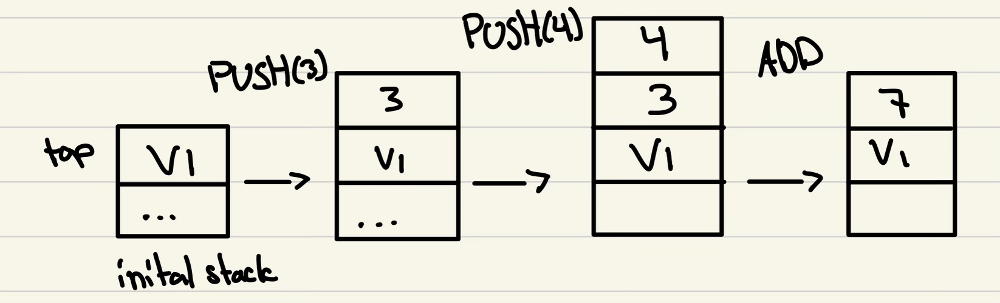
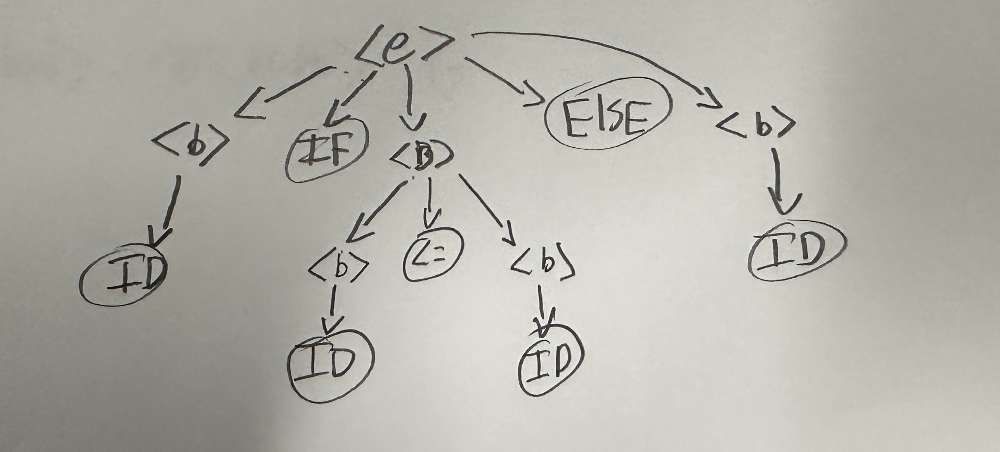
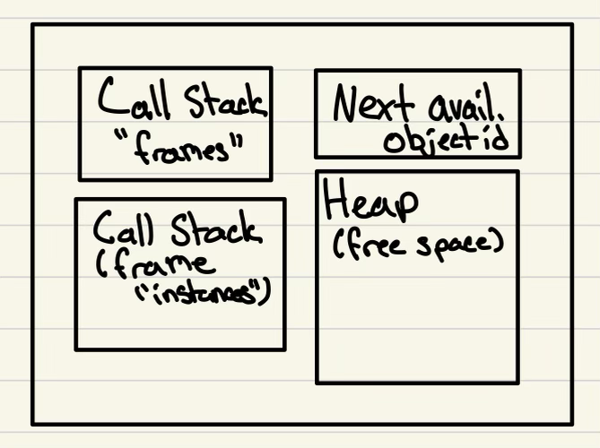
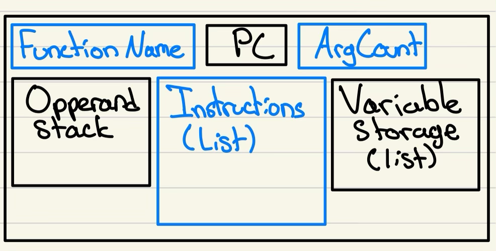
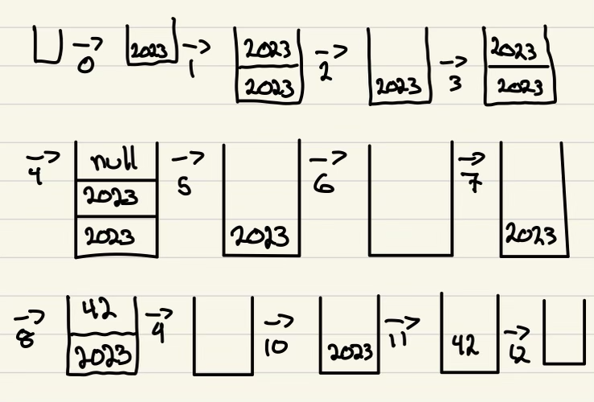

# Unit 2 <!-- omit in toc -->

## Table of Contents <!-- omit in toc -->

* [Lecture 14](#lecture-14)
  * [Interpretation Review](#interpretation-review)
  * [PL "Virtual Machines"](#pl-virtual-machines)
  * [A "bytecode" VM](#a-bytecode-vm)
  * [MyPL VM](#mypl-vm)
* [Monday 7](#monday-7)
  * [Exam Review](#exam-review)
    * [Q1](#q1)
    * [Q2](#q2)
* [Lecture 15](#lecture-15)
  * [MyPL VM Instructions](#mypl-vm-instructions)
    * [a) Constants \& Variables](#a-constants--variables)
    * [b) Arithmetic Ops](#b-arithmetic-ops)
    * [c) Logical Ops](#c-logical-ops)
    * [d) Relational Ops](#d-relational-ops)
    * [e) Jumps (Branching)](#e-jumps-branching)
    * [f) Special Instructions](#f-special-instructions)
    * [g) Functions](#g-functions)
    * [h) Heap Instructions (Arrays, Structs)](#h-heap-instructions-arrays-structs)
    * [i) Built-in Functions](#i-built-in-functions)
  * [MYPL VM Instructions Example](#mypl-vm-instructions-example)
  * [Basic MyPL VM Architecture (vm.h/vm.cpp)](#basic-mypl-vm-architecture-vmhvmcpp)
* [Lecture 16](#lecture-16)
  * [Implementing Call Instructions](#implementing-call-instructions)
  * [Implementing RET Instructions](#implementing-ret-instructions)
* [Monday 8](#monday-8)
  * [Heap Alloc](#heap-alloc)
  * ["Struct" Heap](#struct-heap)
  * ["Array" heap](#array-heap)
  * [VM Instruction examples](#vm-instruction-examples)
* [Lecture 17](#lecture-17)
  * [MyPL Code Generation Examples](#mypl-code-generation-examples)
  * [Program Nodes](#program-nodes)
  * [StructDef Nodes](#structdef-nodes)
  * [Functions](#functions)
  * [Code Generation](#code-generation)
  * [Simple Rvalues (Literals)](#simple-rvalues-literals)
* [Lecture 18](#lecture-18)
  * [MyPL Code Generation](#mypl-code-generation)
  * [While Loops](#while-loops)
  * [For Loops](#for-loops)
  * [Object Creation - Structs](#object-creation---structs)
  * [Object Creation - Arrays](#object-creation---arrays)
  * [General rvalue path \& lvalues](#general-rvalue-path--lvalues)
* [Monday 9](#monday-9)
* [Lecture 19](#lecture-19)
  * [Basic Paradigms](#basic-paradigms)
    * [Imperative vs Declarative](#imperative-vs-declarative)
  * [Other Paradigms](#other-paradigms)
  * [From Turing Machines to Imperative Programming](#from-turing-machines-to-imperative-programming)
    * [Examples of Turing Machine](#examples-of-turing-machine)
  * [Turing Complete](#turing-complete)
    * [Accidentally Turing Complete "languages"](#accidentally-turing-complete-languages)
* [Lecture 20](#lecture-20)
  * [Basic idea of $\\lambda$-Calculus](#basic-idea-of-lambda-calculus)
    * [Rules of $\\lambda$-Calculus](#rules-of-lambda-calculus)
  * [How is $\\lambda$-Calculus as powerful as Turing Machines?](#how-is-lambda-calculus-as-powerful-as-turing-machines)
* [Lecture 21](#lecture-21)
  * [$\\lambda$-Calc Wrap up](#lambda-calc-wrap-up)
    * [Recursion via "Y Combinators"](#recursion-via-y-combinators)
    * [High level LC Notes](#high-level-lc-notes)
  * [Intro to OCaml](#intro-to-ocaml)
    * [High Level OCaml Features/Notes](#high-level-ocaml-featuresnotes)
    * [OCaml examples](#ocaml-examples)
* [Lecture 22](#lecture-22)
  * [Final Project Review](#final-project-review)
  * [OCaml Basics](#ocaml-basics)
  * [OCaml in files](#ocaml-in-files)
  * [OCaml Lists](#ocaml-lists)
* [Monday 10](#monday-10)
  * [$\\lambda$-Calculus recursion examples](#lambda-calculus-recursion-examples)
    * [Y-Combinator](#y-combinator)
    * [First try at factorials (FAC fails)](#first-try-at-factorials-fac-fails)
    * [Paramitize FAC](#paramitize-fac)
    * [Apply FAC using a Y-Parameter](#apply-fac-using-a-y-parameter)
  * [OCaml Basic Functions](#ocaml-basic-functions)

## Lecture 14

### Interpretation Review

* Abstract Syntax Tree (AST) Interpreters
  * Execute the program directly form the AST
* Bytecode Interpreters (aka VMs)
  * Intermediate representation is bytecode
  * Interpreter runs bytecode directly
* Just-in-time Compiler (JIT)
  * Instead of interpreting bytecode, this generates and runs machine code
  * Monitor running code (e.g., frequent "hot spots") and optimize accordingly

### PL "Virtual Machines"

Implements and "abstract computer (CPU)"

* Like a computer, has memory, instruction set, etc.
* Instructions are very similar to assembly
  * but often simpler & higher-level
  * load (vals into memory), store (vals into memory), add (vals in memory), jump, etc.

### A "bytecode" VM

(not the MyPL vm)

* Instructions are encoded in binary
  * e.g., in JVM (`JavaVirtualMachine`), binary is stored in `.class` files

```s
ADD 3 4 # 0110 (opcode) 0011 (operand 1) 0100 (operand 2)
# 01100110100
```

### MyPL VM

* Based on the JVM `JavaVirtualMachine` Architecture
  * Stack based Machine
    * Instead of registers, this uses a stack
* Via API calls, not encoding/decoding
* Take shortcuts
* Performs minimal error checking

1 - DataTypes/Values

* Uses c++ types (int, string, double, ...)
* uses nullptr for MyPL null values

2 - Abstract Stack Machine

* Instead of registers, the VM has "operand" stack



The VM Components...

* Operand stack
* Memory for storing variables `<vector>`
* Heap storage
* Function-call stack
  * "Frames"

3 - MyPL Instruction Set...  
Note: `OP(v)` says `v` supplied directly to instruction: `PUSH(v)` means `v` is supplied to the instruction instead of provided by the operand stack

* Constants & Variables
  * `PUSH(v)`, push the constant onto the stack
  * `POP`, pops a value from the stack
  * `LOAD(i)`, i is the index/address of the memory that we want to push onto the stack
    * `grabs value at i, pushes value onto stack`
  * `STORE(i)`
    * `POP v, store v at mem address i`

  ```cpp
  x = 0 // generates a store instruction
  y = x // generates a load instruction
  ```

* Arithmetic Instructions
  * `ADD`
    * `pop x, pop y, push(y+x)`
  * `SUB`
    * `pop x, pop y, push(y-x)`
    * note how the order is y-x, with x being the first thing popped
  * `MUL`
    * `pop x, pop y, push(y*x)`
  * `DIV`
    * `pop x, pop y, push(y/x)`
* Logical Operators
  * `AND`
    * `pop x, pop y, push(y&&x)`
  * `OR`
    * `pop x, pop y, push(y||x)`
  * `NOT`
    * `pop x, push(!x)`
* Relational (Comparison) operators
  * `CMPLT` - Compare Lessthan
    * `pop x, pop y, push(y<x)`
  * `CMPLE`
    * `y<=x`
  * `CMPGT`
    * `y>x`
  * `GMPGE`
    * `y>=x`
  * `CMPEQ`
    * `y==x`
  * `CMPNE`
    * `y!=x`
* Jumps
  * `JMP(i)`
    * jumps to instruction i
  * `JMPF(i)`
    * `pop x, if x is false, jumps to i`

## Monday 7

### Exam Review

#### Q1

a.  
Source Code -> Lexical Analysis ---Token-Stream---> Syntactic Analysis ---AST---> Semantic Analysis ---AST---> (Backend)

b.  

* Compiler: High Level -> Low Level
* Transpiler: High Level -> High Level
* Interpreter: High Level -> IR Executed by VM

c.  

Is this LL(k)?

```txt
<e> ::= <b> IF <b> ELSE <b> | <b>
<b> ::= <b> <= <b> | <b> AND <b> | ID
```

* No (Left side recursion)

Rewrite it as LL(1)

```txt
<e> ::= <b> <e_tail>
<e_tail> ::= IF <b> ELSE <b> | empty
<b> ::= ID <b_tail>
<b_tail> ::= <= <b> | AND <b> | empty
```

#### Q2

a. Using the previous grammar, derive `x if x <=y else y` (left most)

```xml
<e> -> <b> IF <b> ELSE <b>
    -> ID IF <b> ELSE <b>
    -> ID IF <b> <= <b> ELSE <b>
    -> ID IF ID <= <b> ELSE <b>
    -> ID IF ID <= ID ELSE <b>
    -> ID IF ID <= ID ELSE ID
```

b. Using the previous grammar, derive `x if x <=y else y` (right most)

```xml
<e> -> <b> IF <b> ELSE <b>
    -> <b> IF <b> ELSE ID
    -> <b> IF <b> <= <b> ELSE ID
    -> <b> IF <b> <= ID ELSE ID
    -> <b> IF ID <= ID ELSE ID
    -> ID IF ID <= ID ELSE ID
```

c. Draw the parse tree


[Image taken from my Exam]

d. Write an LL(1) grammar to represent well-formed floating point values that cannot have a leading zero and that are not required to have a digit before or after the decimal point

```xml
(<d>+ is <d><d>* (one or more))

<f> ::= <p><d>*.<d>*|.<d>+|0.<d>*
<p> ::= 1|2|3|...|9
<d> ::= 0 | <p>
```

e. Another grammar that includes path expressions, functions, and array accessing.

```xml
<p> ::= ID <r> <p`> 
<p`> ::= .<p> | empty
<r> ::= LBRACKET <expr> RBRACKET | LPAREN <a> RPAREN | empty
<a> ::= <expr> (COMMA <expr>* | empty
```

## Lecture 15

### MyPL VM Instructions

* Operand Stack
  * push and pop values
  * Operand - argument to an instruction
  * most instructions will take their arguments off the operand stack, then place their results onto the operand stack

* [a) Constants \& Variables](#a-constants--variables)
* [b) Arithmetic Ops](#b-arithmetic-ops)
* [c) Logical Ops](#c-logical-ops)
* [d) Relational Ops](#d-relational-ops)
* [e) Jumps (Branching)](#e-jumps-branching)
* [f) Special Instructions](#f-special-instructions)
* [g) Functions](#g-functions)
* [h) Heap Instructions (Arrays, Structs)](#h-heap-instructions-arrays-structs)
* [i) Built-in Functions](#i-built-in-functions)

#### a) Constants & Variables

```cpp
PUSH(v)
POP()
STORE(i) 
    POP, but moved to be stored at address i
LOAD(i)
    PUSHES the value stored at address i
```

#### b) Arithmetic Ops

```cpp
ADD ...
    POP(x), POP(y), PUSH(y+x)
SUB ...
    POP(x), POP(y), PUSH(y-x)
MUL ...
    POP(x), POP(y), PUSH(y*x)
DIV ...
    POP(x), POP(y), PUSH(y/x)
```

#### c) Logical Ops

```cpp
AND ...
    POP(x), POP(y), PUSH(y && x)
OR ...
    POP(x), POP(y), PUSH(y || x)
NOT ...
    POP(x), PUSH(!x)
```

#### d) Relational Ops

```cpp
CMPLT ...
    POP(x), POP(y), PUSH(y<x)
CMPLE ...
    POP(x), POP(y), PUSH(y<=x)

CMPGT ...
    POP(x), POP(y), PUSH(y>x)

CMPGE ...
    POP(x), POP(y), PUSH(y>=x)

GMPEQ ...
    POP(x), POP(y), PUSH(y==x)

CMPNE ...
    POP(x), POP(y), PUSH(y!=x)
```

#### e) Jumps (Branching)

```cpp
JMP(i)
    Jumps to some index
    Instructions are numbered starting at 0
JMPF(i) ...
    POP(x), IF(x==false){JMP(i)}
```

#### f) Special Instructions

```cpp
DUP() ...
    POP(x), PUSH(x), PUSH(x)
NOP() ...
    Whenever we have a loop, at the very end we put a NOP()
    This allows us to know where to jump to
```

#### g) Functions

```cpp
CALL(f) ...
    calls a function f
RET() ...
    exits function, passes back value at the top of the stack
```

#### h) Heap Instructions (Arrays, Structs)

```cpp
ALLOCS() ...
    Allocates a struct object on the heap, PUSH OID x
        OIDs in MyPL are ints, they start at 2023
        First OID is 2023, next is 2024, next is 2025, ...
ALLOCA() ...
    Allocates an array object on the heap, PUSH OID x
ADDF(f) ...
    POP(OID(x)), add field f to obj(x)
    adds a field to a struct object
    f is the field
SETF(f) ...
    POP(OID(x)), POP(y), obj(x).f = y
GETF(f) ...
    POP(OID(x)), PUSH(obj(x).f)
SETI()
    POP(x), POP(y), POP(z), Set obj(z)[y] = x
    Sets the index 
    a[0] = "abc"
    First you push the OID (a) 
    Then you push the index expression (0)
    Then you push the RHS ("abc")
    Then you call SETI()
GETI() ...
    POP(x), POP(y), PUSH(obj(y)[x])
```

#### i) Built-in Functions

```cpp
WRITE() ...
    POP(x), outputs x
READ() ...
    PUSH(x)
    x is from std::in
SLEN() ...
    POP(str(x)), PUSH(len(x))
ALEN() ...
    POP(OID(x)), PUSH(len(obj(x))
GETC() ...
    POP(str(x)), POP(int(y)), PUSH(x[y])
TOINT() ...
    POP(x), PUSH(to_int(x))
TODBL() ...
    POP(x), PUSH(to_double(x))
TOSTR() ...
    POP(x), PUSH(to_string(x))
CONCAT() ...
    POP(x), POP(y), PUSH(y+x) string s
```

### MYPL VM Instructions Example

Generate VM Instructions for:

```cpp
// i : index 0
// j : index 1
while(i<j){
    j=j+1
}
```

```cpp
0 LOAD(0) // loads i
1 LOAD(1) // loads j
2 CMPLT() // compares the top two items on the stack (pushes result)
3 JMPF(9) // Jump to the end (outside the loop) if the val on top the stack is false
4 LOAD(1) // loads j
5 PUSH(1) // pushes 1
6 ADD() // adds the top two items on the stack (pushes result)
7 STORE(1) // stores top of stack (j+1)
8 JMP(0)
9 NOP()
```

### Basic MyPL VM Architecture (vm.h/vm.cpp)




(Blue = Frame Info)

## Lecture 16

### Implementing Call Instructions

Example: f(...) =calls=> g1(...) =calls=> g2(...)

1. Get name for g

    ```cpp
    string g = get<string>(instr.operand().value()); // all call instructions have an operand
    ```

2. Instantiate a new frame & set its frame info

    ```cpp
    shared_ptr<VMFrame> new_frame = make_shared<VMFrame>();
    new_frame->info = frame_info[g];
    ```

3. Then push it onto the call_stack

    ```cpp
    call_stack.push(new_frame); // this is now g2
    ```

4. Copy arg-count # of args into g2

    ```cpp
    VMValue x = frame->operand_stack.top();
    new_frame->operand_stack.push(x);
    frame->operand_stack.pop();
    ```

5. Set current frame in VM to new_frame

    ```cpp
    frame = new_frame;
    ```

### Implementing RET Instructions

1. Grab return value

    ```cpp
    VMValue v = frame->operand_stack.top();
    ```

2. Pop frame

    ```cpp
    call_stack.pop();
    frame = call_stack.top();
    ```

3. If frame exists (it wont exist if you are returning from main)

    ```cpp
    // push return value to the top of the stack
    frame->operand_stack.push(v);
    ```

## Monday 8

### Heap Alloc

* Heap Details
  * Seperated into struct & array (object) heaps
  * Each object (struct or array) assigned a unique object id
    * First object id is 2023 in MyPL

```cpp
Node n1 = new Node
// generates some space in the heap,
// then there is an object ID that is created

// n1 -> 2023
Node n2 = new Node
// n2 -> 2024

// is n1 the same object as n2
// their ids are compared
if(n1 == n2){
    // doesnt happen
}

n1 = n2
// n2 -> 2023
if(n1 == n2){
    // happens
}
```

### "Struct" Heap

* Each struct object is represented as a map (field- value pairs)
  * `unordered_map<string, VMValue>`

    ```cpp
    struct Node {
        int val
        Node next
    }

    {"val": 10, "next": nullptr}
    {"val": 0, "next": 2023}
    ```

* Heap is a OID to obj map
  * `unordered_map<int, unordered_map<string, VMValue>> struct_heap`
* add, set, get fields

```cpp
ALLOCS()

struct_heap[next_obj_id] = {};
frame->operand_stack.push(next_obj_id); // put the object IDs on the top of the operand stack
++next_obj_id;
```

### "Array" heap

* Each array object is represented as a vector
  * You push onto the stack the size of the array
  * Then you allocate size
  * Then you initialize the elements
* Assigned a fixed number of slots on allocation
* Given default value of each slot
* Can get & set values by index
* `unordered_map<int,vector<VMValue>> array_heap`

```cpp
array int xs = new int[10]
// allocates a new vector of size 10, fills the values with nulls
```

```cpp
ALLOCA()
// ...pop def.value, pop size

VMValue val = frame->operand_stack.top();
frame->operand_stack.pop();
int size = get<int>(frame->operand_stack.top());
frame->operand_stack.pop();

array_heap[next_obj_id] = vector<VMValue>(size, val); // allocate. each element has a value of val
frame->operand_stack.push(next_obj_id);
++next_obj_id;
```

### VM Instruction examples

1. Show how the operand stack changes after each instruction

    ```cpp
    Frame 'main'
    0: PUSH(42)
    |    |
    |    |
    | 42 |
    |____|
    1: PUSH(37)
    |    |
    | 37 |
    | 42 |
    |____|
    2: ADD()
    |    |
    |    |
    | 79 |   (42 + 37)
    |____|
    3: STORE(0)
    |    |
    |    |
    |    |
    |____|   0->79
    4: LOAD(0)
    |    |
    |    |
    | 79 |
    |____|   0->79
    5: WRITE()
    |    |
    |    |
    |    |
    |____|
    ```

2. Translate to MyPL ... assume var 0 is called "x"

    ```cpp
    void main(){
        int x = 42 + 37
        print(x)
    }
    ```

3. Same as 1:

    ```cpp
    Frame 'main'
    0: PUSH(0)
    |    |
    |    |
    |  0 |
    |____|
    1: STORE(0)
    |    |
    |    |
    |    |
    |____|   0->0
    2: LOAD(0)
    |    |
    |    |
    |  0 |
    |____|
    3: PUSH(2)
    |    |
    |  2 |
    |  0 |
    |____|
    4: CMPLT()
    |    |
    |    |
    |true|
    |____|
    5: JMPF(11)
    |    |
    |    |
    |    |   Doesnt jump
    |____|   0->0 
    6: LOAD(0)
    |    |
    |    |
    |  0 |
    |____|   0->0
    7: PUSH(1)
    |    |
    |  1 |
    |  0 |
    |____|   0->0
    8: ADD()
    |    |
    |    |
    |  1 |
    |____|   0->0
    9: STORE(0)
    |    |
    |    |
    |    |
    |____|   0->1
    10: JMP(2)
    |    |
    |    |
    |  1 |
    |____|   0->1
    ...
    this continues until 0->2
    11: NOP()
    12: LOAD(0)
    |    |
    |    |
    |  2 |
    |____|   0->2
    13: WRITE()
    |    |
    |    |
    |    |
    |____|   
    Ouputs(2)
    ```

4. Translate to MyPL, w/ 0->'i'

    ```cpp
    void main(){
        int i = 0
        while(i<2){
            i = i + 1
        }
        print(i)
    }
    ```

5. Translate to VM instructions

    ```cpp
    void main(){
        string s = input()
        if(s=="blue"){
            print("correct")
        elseif(s=="green"){
            print("correct")
        else{
            print("wrong")
        }
    }
    ```

    ```cpp
    Frame 'main'
    0: READ()
    1: STORE(0)
    2: LOAD(0)
    3: PUSH("blue")
    4: CMPEQ()
    5: JMPF(9) //jumps to the elseif
    6: PUSH("correct")
    7: WRITE()
    8: JMP(18) // ending
    9: LOAD(0)
    10: PUSH("green")
    11: CMPEQ()
    12: JMPF(16) // jumps to the else
    13: PUSH("correct")
    14: write()
    15: JMP(18) // ending
    16: PUSH("wrong")
    17: WRITE()
    18: NOP()
    ```

## Lecture 17

### MyPL Code Generation Examples

The Plan:

* Last step is to convert AST to VM instructions
  * `Semantic, AST` -> `Code Generator, IR (Intermediate Representation)` -> `VM`
* Will use the visitor pattern
* Basic setup, then examples

```cpp
class CodeGenerator: public visitor
{
public:
    CodeGenerator(VM& vm);
    void visit(Program& p);
    ...

private:
    VM& vm; // reference because we want vm to be updated at the end of and throughout  code generation
    VMFrameInfo curr_frame; // the information associated with the current frame
    VarTable var_table; // maps the variables to the variable indexes in the current frame
    unordered_map<string, StructDef> struct_defs;

};
```

```cpp
class VarTable
{
public:
    void push_environment();
    void pop_environment();
    bool empty();

    void add(const string& var_name);
    int get(const string& var_name);
    //... to_string

private:
    vector<unordered_map<string, int>> environment;
    int next_index = 0;
};
```

```cpp
void main() { // push_environment
    int i = 0 
    // PUSH(0) [for the right hand size]
    // var_table.add("i");
    // LOAD(get("i")) [load the value of 0 into i
    ...
    i=1
    // PUSH(1)
    // STORE(get("i"))
    ...
    while(i<...){ // push_environment (pushing a new var_table)
        int x = 10
    } // pop_environment
} // pop_environment
```

```cpp
VMInstr instr = VMInstr::STORE(var_table.get(var_name));
instr.set_comment("variable: " + var_name);
curr_frame.instructions.push_back(instr);

// then in terminal
...

mypl --ir ...
>    ...
>    store(2) // variable x
```

### Program Nodes

```cpp
void visit(Program& p){
    for(auto& struct_def : p.struct_defs){
        struct_def.accept(*this);
    }
    for(auto& fun_def : p.fun_defs){
        fun_def.accept(*this);
    }
}
```

### StructDef Nodes

```cpp
// add object for later
void visit(StructDef& s){
    struct_defs[s.struct_name.lexeme()] = s;
}
```

### Functions

* In visit(FunDef& f)
  * Create a new frame info object (as `curr_frame`)
  * Push a new environment for `var_table`
  * Store each argument passed
    * Add an entry to the var_table for each parameter
    * Create one `STORE(...)` per parameter, use a loop
  * Visit each body statement
  * push `nullptr`, add `RET` if last instruction generated wasn't return
  * Pop `var_table` environment
  * Add the frame info to the vm

```cpp
int f(int x){
    if(x == 0){
        return x + 1
    elseif(x>0){
        return x-1
    }
    // there is no explicit return
    // we always assume f returns SOME value
    // in this case we need to generate a return statement
}
```

### Code Generation

```cpp
void f(){
}

// Code Generated
Frame 'f':
    0: PUSH(nullptr)
    1: RET()
```

```cpp
void f(int x){
}

// Code Generated
Frame 'f':
    0: STORE(0)
    1: PUSH(nullptr)
    2: RET()
```

```cpp
void f(int x, bool y){
}

// Code Generated 
Frame 'f':
    0: STORE (0) // store parameter x
    1: STORE(1) // store parameter y
    2: PUSH(nullptr)
    3: RET()

f(3,true)

| true |
|  3   |
|______|

f's op stack
|  3   |
| true |
|______|
```

```cpp
int f(int x){
    return x + 1
}

// Code Generated
Frame 'f':
    0: STORE(0) // store x
    1: LOAD(0) // loads x
    2: PUSH(1) // pushes 1
    3: ADD() // pushes x + 1
    4: RET()
```

### Simple Rvalues (Literals)

* Generate a `PUSH` with the cooresponding `VMValue`
  * Create a `VMValue` out of the `.lexeme()` of the token
    * Needs to convert the string of the lexeme to an int or double

```cpp
// simple r value is v
if(v.value.type() == TokenType::INT_VAL){
    int val = stoi(v.value.lexeme());
    curr_frame.instructions.push_back(VMInstr::PUSH(val));
}elseif(double){
}elseif(null){
    push nullptr
}elseif(bool){
}elseif(char){
    deal with \n, \t, etc..., there is a helper function for this that he provides
    push the lexeme
}
```

## Lecture 18

### MyPL Code Generation

```cpp
if (x>=y){
    print(2*y)
}else{
    print(x)
}

x->0
y->1

// Code Generated
0: LOAD(0)
1: LOAD(1)
2: CMPGE()
3: JMPF(9)
4: PUSH(2)
5: LOAD(1)
6: MUL()
7: WRITE()
8: JMP(11)
9: LOAD(0)
10: WRITE()
11: NOP()
```

### While Loops

1. Grab starting idex of first instruction (to jump back to)
1. Call while condition visitor
1. Create and add JMPF instruction w/ dummy index (fill in later)
1. Push environment in var table
1. Visit statements
1. Pop environment
1. Add JMP to starting index
1. Add NOP instr (for JMPF)
1. Update JMPF operand to NOP index

```cpp
void f(int x){
    int i = 0
    while(i<10){
        i = i + x
    }
}

// Generated Code
Frame "f"
    0: Store(0) // Index (0) retrieved from the var table
    1: PUSH(0)
    2: STORE(1) // Add i to the var table, STORE(index)
    3: LOAD(1) // load i
    4: PUSH(10) // push 10
    5: CMPLT()
    6: JMPF(12) // don't enter the body
    7: LOAD(1) // i
    8: LOAD(0) // x
    9: ADD() // i + x
    10: STORE(1) // i = i + x
    11: JMP(3)
    12: NOP()
    13: PUSH(nullptr) // no return, so we do it
    14: RET()


    3-12, while visitor
    13,14, fundef visitor
    3-5, Expr visitor
    7-10, Stmt visitor
```

### For Loops

1. Push environment for first variable declaration
2. Rest similar to while
3. Pop environment
4. Visit assign stmt before JMP

```cpp
void main(){
    int x = 0
    for(int i = 0; i < 5; i = i + 1){
        x = x + i;
    }
}

is the same as 

{
    int i = 0
    while(i < 5){
        {
            x = x + i
        }
        i = i + 1
    }
}
```

### Object Creation - Structs

1. Create and add an ALLOCS()
2. Initialize the corresponding fields
   1. Get the field info. from StructDef
   2. Use ADDF, SETF to add & set value for each field

```cpp
struct T{int x. bool y}
void main(){
    T t = new T
}

// Generated Code
Frame "main"
    0: ALLOCS() // 2023 is pushed onto the stack. 
                // Struct heap has a mapping {2023->{}}
    1: DUP() // stack: 2023, 2023
    2: ADDF(x) // pop 2023, add x to object 2023 (initial type null)
    3: DUP()
    4: PUSH(nullptr) // stack: nullptr, 2023, 2023
    5: SETF(x) // pop val (nullptr), pop oid (2023), object(2023).x = val
    6: DUP()
    7: ADDF(y)
    8: DUP()
    9: PUSH(nullptr)
    10: SETF(y)
    11: STORE(0) // 0 is the index of t, giving it the value of 2023
    12: PUSH(nullptr)
    13: RET()


ADDF(f): pop oid, add f to obj(oid)
SETF(f): pop val, pop oid, set obj(oid)=val
```

### Object Creation - Arrays

1. Create and add an ALLOCA()
1. Requires size of array & initial values

```cpp
void main(){
    array int xs = new int[10]
    xs[0] = 42
}

// Code Generated
Frame "main"
    0: PUSH(10) // Size
    1: PUSH(nullptr)
    2: ALLOCA()
    3: STORE(0) // xs has the value of the OID
    4: LOAD(0) // put the OID on the stack
    5: PUSH(0) // put the index on the stack
    6: PUSH(42) // put the value on the stack
    7: SETI()
    8: PUSH(nullptr)
    9: RET()

0-3, generated by newrvalue for the array

ALLOCA(): pop val, pop size, create vector w/ size vals, add to map w/ new oid, pushes oid
SETI(): pop x, y, and z, set array obj(z)[y] = x; top[val, index, oid]bottom
```

### General rvalue path & lvalues

1. Load the variable (e.g. the p in p.x.y.z)
2. Repeatedly call GETF() [get field] [also assuming its not an array] instruction for remaining path (fields) (e.g. x,y,z)
3. For array access, generate the index code & use GETI()
4. For assignment statement (lvalue), the last instruction is either SETF() or SETI()

## Monday 9

1. Convert the following MyPL code to corresponding VM instructions

    ```cpp
    if(true){
        print("Blue")
    }
    else aif(false){
        print("Green")
    }
    else if(not false){
        print("Red")
    }
    else{
        print("Yellow")
    }
    ```

    ```cpp
    PUSH(true) // 0
    JMPF(5) // 1
    PUSH("Blue") // 2
    WRITE() // 3
    JMP(18) // 4
    PUSH(false) // 5
    JMPF(10) // 6
    PUSH("Green") // 7
    WRITE() // 8
    JMP(18) // 9 
    PUSH(false) // 10
    NOT() // 11
    JMPF(16) // 12
    PUSH("Red") // 13
    WRITE() // 14
    JMP(18) // 15
    PUSH("Yellow") // 16
    WRITE() // 17
    NOP() // 18
    ```

    Implementation Hints(`visit(IfStmt&)`)
    * Vector of JMP indexes:
      * prev example: (4, 9, 15)
    * Store prev. JMPF index to update with next condition check

2. Show the operand stack after each instruction. Show the final struct heap and variables.

    ```cpp
    0: ALLOCS()
    1: DUP()
    2: ADDF(x)
    3: DUP()
    4: PUSH(nullptr)
    5: SETF(x)
    6: STORE(0)
    7: LOAD(0)
    8: PUSH(42)
    9: SETF(x)
    10: LOAD(0)
    11: GETF(x)
    12: WRITE()
    ```

    

3. Create the MyPL code for the following VM instructions

    ```cpp
    0: ALLOCS()
    1: DUP()
    2: ADDF(x)
    3: DUP()
    4: PUSH(nullptr)
    5: SETF(x)
    6: STORE(0) // s
    7: LOAD(0)
    8: PUSH(42)
    9: SETF(x)
    10: LOAD(0)
    11: GETF(x)
    12: WRITE()

    struct T {int x}
    ...
    T t = new T
    t.x = 42
    print(t.x)
    ```

4. Concert to MyPL code

    ```cpp
    0: LOAD(0)
    1: GETF(children)
    2: PUSH(0)
    3: GETI()
    4: PUSH(42)
    5: SETF(val)
    6: LOAD(0)
    7: GETF(children)
    8: PUSH(0)
    9: GETI()
    10: GETF(val)
    11: WRITE()

    struct Node {int val, array Node children}
    ...
    n.children[0].val = 42
    print(n.children[0].val)
    ```

## Lecture 19

### Basic Paradigms

Programming Language Paradigms:

* First-Order logic (Late 1800s)
  * All of mathematics can be encoded into logic
    * Proof procedures
    * This can lead to a possible way to automate proofs
* Turing Machines (Early 1930s)
  * Allen Turing dug into the idea of First-Order logic and its ability to automate proofs
  * Von Neumann architecture
* Imperative Languages (1950s)
  * Based on Turing Machines
  * FORTRAN was the first Imperative Language
  * You tell the machine what to do
    * C, C++, Java, Python
    * Think assembly, you are sending instructions to the cpu
    * Very step by step
* Lambda Calculus (Early 1930s)
  * Another subset of First-Order logic
* Functional Languages (1950s)
  * Based on Lambda Calculus
  * LISP was the first Functional Language
* Logic Programming (1970s)
  * Based on First-Order logic
  * PROLOG is first popular Logic Language

#### Imperative vs Declarative

Imperative | Declarative
-|-
Tell machine what to do and **how** to do it|Specify **what** the result should look like
Specify the steps|Figures out the steps
Telling someone the recipe|Giving them an order

### Other Paradigms

* Object Oriented
* Static vs Dynamic types
* Compiler vs Interpreter
* Script-based

### From Turing Machines to Imperative Programming

Turing Machines:

1. Infinite tape
   * The tape is broken into cells
   * Each cell can store something (think of RAM)
2. Read/Write head
   * Positioned at a cell in the tape
   * This head can:
     * You can read a symbol out of the cell
     * You can write a symbol into the cell
     * Move the head to the right
     * Move the head to the left
3. State register
   * Keeps track of the current state
4. Transition table (Function)
   * Current state and Current symbol -> New state and New symbol and new head position (L/R)

Specify the start state  
Specify the halt state

#### Examples of Turing Machine

1. Assume: $S_1$ is the start state, $S_3$ is the halt state, read/write head is to the left of the input

    curr state|curr symbol|new symbol|new state|direction
    |-|-|-|-|-|
    $S_1$|blank|blank|$S_2$|R
    $S_2$|a|b|$S_2$|R
    $S_2$|b|b|$S_2$|R
    $S_2$|blank|blank|$S_3$|L

    This machine takes in a string and replaces all a's with b's

2. Write a TM to flip a's and b's

    curr state|curr symbol|new symbol|new state|direction
    |-|-|-|-|-|
    $S_1$|blank|blank|$S_2$|R
    $S_2$|a|b|$S_2$|R
    $S_2$|b|a|$S_2$|R
    $S_2$|blank|blank|$S_3$|L

3. Write a TM to subtract 1 from a binary number  
    $S_1$ is the start state, $S_3$ is the halt state, read/write head is to the left of the input

    curr state|curr symbol|new symbol|new state|direction
    |-|-|-|-|-|
    $S_1$|blank|blank|$S_2$|R
    $S_2$|0|0|$S_2$|R
    $S_2$|1|1|$S_2$|R
    $S_2$|blank|blank|$S_3$|L
    $S_3$|0|0|$S_3$|L
    $S_3$|1|0|$S_4$|R
    $S_4$|0|1|$S_4$|R
    $S_4$|blank|blank|$S_5$|L

    S1 is moving to the first char  
    S2 is moving to the end
    S3 is moving left until see 1
    S4 is write 1s  
    S5 is halt  

    (Go to the right all the way, if a 0, change to 1 then move left. Continue until the value is a 1. change to 0)

### Turing Complete

*Every computable function can be computed by a Turing Machine* - Church Turing Thesis

* "Universal" TM
  * Its possible to write a TM, that can take a TM as an input and execute the TM (Take an input and run it)
* A PL is *turing complete* if it can simulate4 any TM
  * You can write a program that can do the same thing as any TM
<!--- Break --->
* PL's that are Turing Complete
  * C, C++, Java, Python, MyPL
  * They have
    * Looping
    * Memory
    * If statements
* PL's that are **NOT** Turing Complete
  * Basic SQL, ReGeX, HTML, XML, JSON, YAML, markdown

#### Accidentally Turing Complete "languages"

* Excel Spreedsheets
* PowerPoint Presentations
* MTG (Magic The Gathering)
* Pokemon Yellow (GB Game)
  * Remote Code Execution

## Lecture 20

### Basic idea of $\lambda$-Calculus

* TMs are (roughly) the underlying model of computation in imperative languages
* $\lambda$-calculus is (roughly) the underlying model of computation of functional languages

#### Rules of $\lambda$-Calculus

1. A *program* in $\lambda$-c is made out of $\lambda$-Functions; unnamed, single-variable functions
    * $\lambda x .x + 1$
      * Function that takes x (the one parameter), and returns x + 1
    * $\lambda x.x$
      * Takes in x, returns x (*identity function*
    * How to do multiple-variable
      * `int g(int x, int y){return x + y;}`
      * $\lambda x.(\lambda .x+y) \equiv$ `g`
        * But it uses prefix notation, so the correct way is
          * $\lambda x.(\lambda .+xy)$
    * $\lambda x.(\lambda y.x)$
      * Function that takes an x and returns a function that takes a y and returns x
      * `int h(int x, int y){return x;}`
    * $\lambda xy.x \equiv \lambda x.(\lambda y.x)$
      * shorthand for the example above
2. Function application
    * Left to right application (*"reduces to"*)
    * `+ 3 4`
      * `+` function
      * `3` 1st parameter
      * `4` 2nd parameter
      * `(+3)4`
    * $(\lambda x.x)$ 0
      1. 0 is input
      2. 0 is bound to x
      3. result is 0 (x)
    * $(\lambda x.(\lambda y.x))$ 3 4
      1. $(\lambda x.(\lambda y.x))$ 3 4
      2. $(\lambda y.3)$ 4
      3. Reduces to 3
3. Expressions
    * Can be:
      * A function
      * An application (i.e. **f(3)** + 5)
      * A variable
      * A constant
    * Lambda functions have the form: $\lambda x . e$ | $x=$variable, $e=$expression
    * An application has the form: $e_1 e_2$
      * Passing the expression/function $e_2$ into $e_1$

### How is $\lambda$-Calculus as powerful as Turing Machines?

1. Conditionals
    $\lambda x.(\lambda y.x) = True$  
    $\lambda x.(\lambda y.x) = False$  
    $\lambda xy.xy(\lambda uv.v) \equiv \lambda xy.xyF = And$  
    $\lambda xy.x(\lambda uv.u)y \equiv \lambda xy.xTy = Or$  
    $\lambda x.x(\lambda uv.v)(\lambda yz.y) \equiv \lambda xFT = Not$

    Example: True and True

    T And T $\equiv$ And TT $\equiv (\lambda xy.xyF)TT \equiv \underline{T}TF \equiv (\lambda x. (\lambda y.x)) TF \equiv (\lambda y.T)F \equiv T$

    Example: True and False

    T and F $\equiv$ And TF $\equiv (\lambda xy.xyF) TF \equiv \underline{T}FF \equiv (\lambda x.(\lambda y.x))FF \equiv (\lambda y.F)F \equiv F$

    Check In:
    1. False and True
    2. False or False
    3. Not True

## Lecture 21

### $\lambda$-Calc Wrap up

$\lambda$-Calculus expressions:

* In general (not just LC), Expressions always evaluate to a value
* LC has 4 types of expressions
    1. Literal (Constants), e.g. 1
    2. Variable, e.g. x
    3. Function application, e.g. $e_{1} e_{2}$
    4. $\lambda$-function, e.g. $\lambda x.(\lambda y.x))$

IF True Then 3 Else 4 => IF T 3 4 => 3

#### Recursion via "Y Combinators"

* $R \equiv \lambda y.(\lambda x.y(xx))(\lambda x.y(xx))$
* $R$ stands for recursion
* $y$ is the function we want to apply recursively
* The basic idea is that you call this by passing in a function (the $y$)
* This continues forever, so you need to have a conditional in order for it to start

Example:

$R_{g}$  
$\equiv (\lambda y.(\lambda x.y(xx))(\lambda x.y(xx)))g$  
$\equiv (\lambda x.g(xx)(\lambda x.g(xx))$  
$\equiv g((\lambda x.g(xx))(\lambda x.g(xx)))$  [Notice how the same pattern is within it as the previous step]  
$\equiv g(R_{g})$  
$\equiv g(g(R_{g}))$  
$\equiv g(g(g(R_{g})))$  
$\equiv g(g(g(g(...))))$  

#### High level LC Notes

* "Higher order"
  * You can pass functions into functions as arguments, as well as return functions from a function.
* All functions take one argument ("currying")
  * All the main functional programming languages support currying. Behind the scenes those languages use it.
* Allows for "partial" function applications

```cpp
int add(int x, int y){
    return x + y
}
// this is not curried 
-> add_one x = add 1 // but this is!
```

* Lazy evaluation
  * Doesn't have to evaluate the values right away
  
```cpp
add(f(...),g(...))
// these functions might be expensive to compute, we dont know if we will use them yet
// in LC and other functional languages they dont require f and g to be executed in order to call add
// instead it returns f(...) + g(...), and this will be evaluated when we actually need the value
```

### Intro to OCaml

#### High Level OCaml Features/Notes

1. A (mostly) "pure" functional langauge
    * Pure (mathematical) functions
      * Given a particular input, you always get back the same output
      * f(3) will always be ...
      * No Side Effects (Does not modify state)
        * **No Global Variables**
        * **No Passing by reference**
        * **No user input**
      * Memoization: The program will remember outputs of a pure function. This will mean that it will not need to recalculate the function if the input is the same
        * Huge performance boost
    * OCaml allows for some (controlled) side effects
      * Input/Output
      * Arrays (refs)
2. Functions are "first-class"
    * Higher order language
    * Every function is curried, meaning it has support for partial function application
3. Static Typing
    * All types checked prior to runtime
    * Uses sophisticated type inference
      * Rarely give a type, everything is figured out by OCaml
      * Unobtrusive - no type annotations
4. Strong Typing
    * Guarantees no type errors at runtime
5. A *Strict* language, but allows lazy evaluation
    * A Strict language eagerly evaluates function arguments.
    * To allow lazy eval, you need to set the mode

```ocaml
let x = 1 / 0 (*error because dividing by 0*)
let x = lazy(1/0)
let y = lazy(lazy.force x * 2) (**still not evaluated because it is lazy**)
```

#### OCaml examples

```ocaml
2 + 3 ;;
- : int = 5

5 / 2 ;;
- : int = 2

1.0 /. 20 ;; (**floating point version of division**)
- : float = 0.5

(+) 3 4 (**prefix version of plus**)
- : int = 7
```

## Lecture 22

### Final Project Review

* Due Thurs Finals Week
* 2-3 Page Report (see instr.)
* 3-5 min youtube video (see instr.) ... demo
* Worth 3 assignments!
* Grading
  * Complete: 30/90 (~33%)
  * Tests: 30/90 (~33%)
  * Other: Quality & Difficulty

### OCaml Basics

```ocaml
1 <> 1 ;;
(*bool = false*)
if true then 1 else 2.0;;
(* type error because the if else expression can only have one type*)
Sys.int_size ;;
(*63*)

'a' ;;
(* char = 'a' *)
"foo";;
(* string = "foo" *)
() ;;
(*unit = () *)
"foo" ^ "bar" ;;
(* string = "foobar" *)
"foo".[0]
(* char = 'f' *)
(float 2) +. 3.0
(* float = 5. *)
int_of_float 3.14;;
(* int 3 *)
```

* There are no variables
  * instead of variables, you establish a "binding" to a certain value
  * binding means it cannot change

```ocaml
let n = e
---
let n = e1 in e2
(* local binding. only visible within the scope of e2*)

let y = 42 in y + 1 ;;
(* int = 43 *)
y ;;
(* error, y is undefined *)

(* global binding *)

let inc x = x+1
(* val inc : int -> int = <fun> *)

inc 10 ;;
(* int = 11 *)

(+) ;;
(* int -> int -> int = <fun> *)

let dec x = x - 1
(* val dec int -> int = <fun> *)

dec 2 ;;
(* int = 1 *)

dec inc 1 ;;
(* int = 1 *)

dec inc 1 ;;
(* this would fail because it goes right to left, passing inc into dec *)
(* Error: This function has type int -> int
       It is applied to too many arguments; maybe you forgot a `;'. *)

dec (inc 1) ;;
(* int = 1 *)
```

### OCaml in files

Extension is `.ml`

```ocaml
(* hello.ml *)
let msg = "Hello World!" ;;
print_endline msg ;;
```

`CPSC326 % ocaml hello.ml`  
`Hello World!`

`ocamlopt` compiles OCaml

### OCaml Lists

* Lists are strange because instead of using commas, you use semi-colons
* Lists are homogeneous
  * When you create a list, the values in the list all have to be the same type

```ocaml
[10; 20; 30]
(* int list = [10; 20; 30] *)
```

## Monday 10

### $\lambda$-Calculus recursion examples

#### Y-Combinator

$R \equiv \lambda y.(\lambda x.y(xx))(\lambda x.y(xx))$  
$R_{f} \equiv \lambda y.(\lambda x.y(xx))(\lambda x.y(xx)) f$  
$\equiv (\lambda x.f(xx))(\lambda x.f(xx))$  
$\equiv f((\lambda x.f(xx))(\lambda x.f(xx)))$  
$\equiv f(R_{f})$  
therefore  
$R_{f} \equiv f(R_{f})$

#### First try at factorials (FAC fails)

FAC $\equiv \lambda$ n.IF(= 1 n )$1 (* n (FAC (- n 1)))  
This fails because it is using FAC in its definition... FAIL!

#### Paramitize FAC

* Applying the Y-Combinator over the FAC function
* We must parameterize FAC

FAC $\equiv \lambda$f.($\lambda$n. IF(= 1 n) 1 (* n (f ( - n 1)))

How does it work?

* If n is 1, it returns on, otherwise it returns the fac of n - 1

#### Apply FAC using a Y-Parameter

(R FAC) 2 $\equiv$ FAC(R FAC)2  
$\equiv (\lambda f.(\lambda n.$IF (= n 1) 1 ( *n (f(- n 1 )...) (R FAC)2
$\equiv \lambda n.IF( = n 1) 1 (* n ((R FAC)(-n1)...)2$  
$\equiv$ if (= 2 1) 1 (*2 ((R FAC) (-2 1)...)  
$\equiv (* 2(($R FAC$) 1))$  
$\equiv$ (* 2 ( FAC (R FAC)) 1 ))

This continues until it is: (* 2 1) because FAC( R FAC) 1 is 1.

### OCaml Basic Functions

1. Convert degrees to radians
   1. W/o naming values

        ```ocaml
        (*takes in deg as a parameter*)
        let degrees_to_radians deg = deg *. (3.14159 /. 180.0)
        ```

   2. W/ naming values using let in

        ```ocaml
        let degrees_to_radians' deg = 
            let pi = 3.14159
            and half_circle = 180.0
            in deg *. (pi /. half_circle)
        ```
